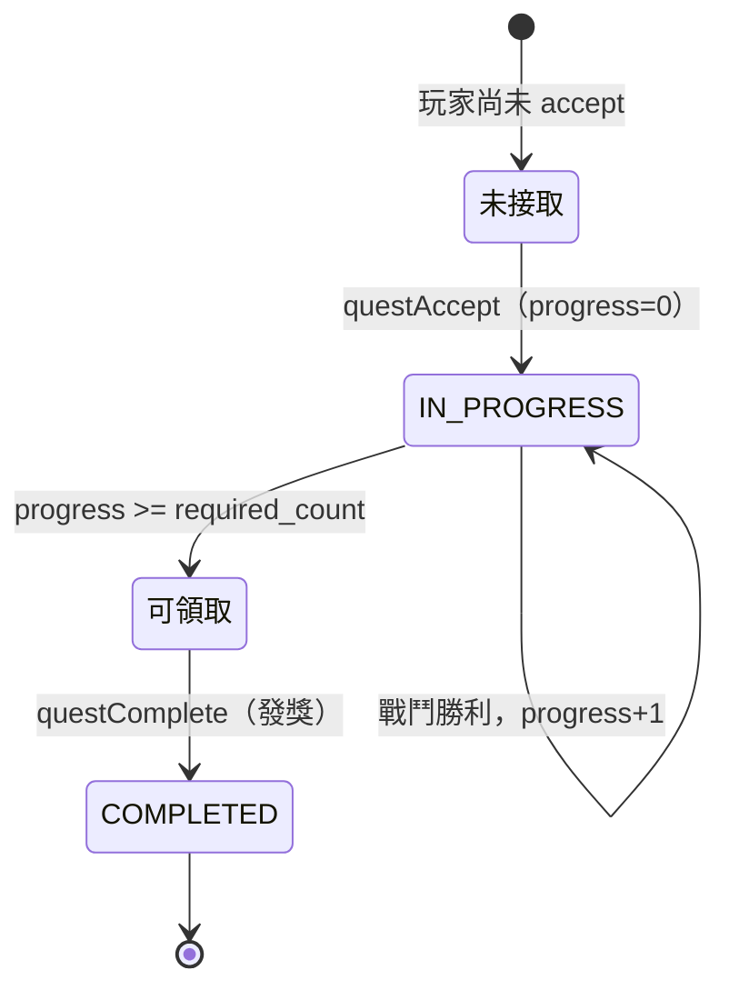
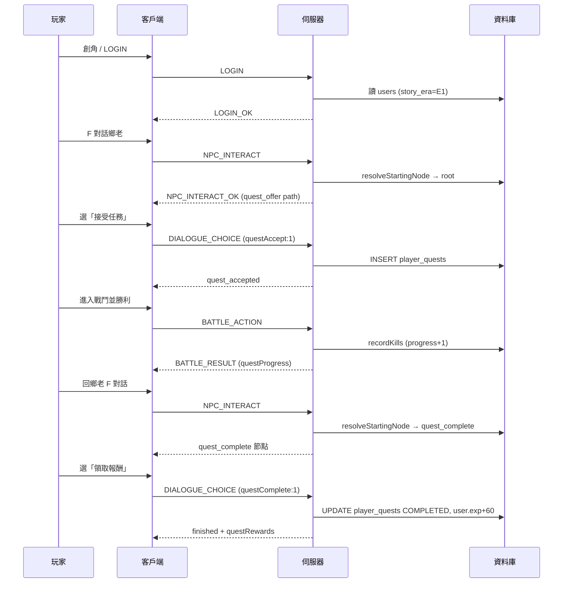

# 任務流程完整說明

> 本文件梳理 **DeJaBu 目前實作中** 的任務／主線系統，涵蓋資料模型、E1 黃巾之亂開局任務鏈、NPC 對話、地圖路線、伺服器邏輯、網路協定與客戶端行為。  
> 相關設計背景亦見 [GAME_MECHANICS.md §7.5](GAME_MECHANICS.md#75-主線章節與個人時間線)、[README.md §任務與主線章節](README.md#任務與主線章節)、[WORLD_MAP.md](WORLD_MAP.md)。

**文件版本對應**：`V32__story_era_and_e1_opening.sql` 之後的程式狀態（2026-06）。

---

## 目錄

1. [系統總覽](#1-系統總覽)
2. [資料模型](#2-資料模型)
3. [主線章節（Story Era）](#3-主線章節story-era)
4. [任務類型與狀態機](#4-任務類型與狀態機)
5. [E1 開局：玩家完整流程](#5-e1-開局玩家完整流程)
6. [任務定義詳表](#6-任務定義詳表)
7. [NPC 對話樹詳表](#7-npc-對話樹詳表)
8. [地圖、路線與敵人](#8-地圖路線與敵人)
9. [戰鬥與進度累積](#9-戰鬥與進度累積)
10. [伺服器端邏輯](#10-伺服器端邏輯)
11. [網路協定](#11-網路協定)
12. [客戶端 UI 與操作](#12-客戶端-ui-與操作)
13. [組隊規則](#13-組隊規則)
14. [邊界情況與常見問題](#14-邊界情況與常見問題)
15. [原始碼索引](#15-原始碼索引)
16. [後續擴充指引](#16-後續擴充指引)

---

## 1. 系統總覽

### 1.1 三層模型

```
┌─────────────────────────────────────────────────────────┐
│  共用層：216 張地圖、傳點、醫館、自由探索、組隊戰鬥       │
│          → 地理永恆，所有玩家走同一套 map_id             │
├─────────────────────────────────────────────────────────┤
│  個人層：users.story_era (E1–E8) + player_quests        │
│          → NPC 對話、可接任務、章節推進存於玩家身上       │
├─────────────────────────────────────────────────────────┤
│  組隊層：有效時間線 = 隊長的 story_era + 隊長任務狀態     │
│          → 對話／主線 NPC 以隊長為準；隊員可旁聽、可參戰   │
└─────────────────────────────────────────────────────────┘
```

### 1.2 核心原則

| 原則 | 說明 |
|------|------|
| **地理永恆** | 地圖不因全服進度而關閉；晚入坑玩家仍從 E1 完整體驗 |
| **故事個人化** | 每位玩家獨立 `story_era` 與 `player_quests`，不做全服統一推進 |
| **組隊跟隊長** | NPC 對話起始節點、任務可用性以**隊長**（或單人自己）為準 |
| **擊殺進度個人化** | 組隊戰鬥勝利後，**每位已接任務的隊員**各自累積 progress |
| **領獎可連坐** | 隊長選「領取報酬」時，全隊**已接且達標**的成員一併結算 |

### 1.3 目前實作範圍

| 項目 | 狀態 |
|------|------|
| 任務類型 `KILL` | ✅ 已實作 |
| 任務類型 `TALK` | ⏳ 資料表預留，邏輯未實作 |
| Story Era E1–E8 列舉 | ✅ 已實作 |
| E1 主線任務鏈（2 環） | ✅ 已實作 |
| E2 及以後主線 | ❌ 尚未插入任務 |
| `unlocks_era` 章節推進 | ✅ 邏輯已實作，**現有任務均未設定此欄** |

---

## 2. 資料模型

### 2.1 `users` — 玩家主線章節

| 欄位 | 型別 | 預設 | 說明 |
|------|------|------|------|
| `story_era` | `VARCHAR(4)` | `'E1'` | 個人主線章節代號 |
| `player_map_id` | `VARCHAR(32)` | `'xuchang'` | 預設出生地圖 |
| `player_x`, `player_y` | `INTEGER` | `8`, `8` | 預設出生座標 |

創角成功訊息（`AuthService.createCharacter`）：

> 中平元年，黃巾賊起。你以鄉勇之身，踏上了這亂世之路。

### 2.2 `quests` — 任務定義

| 欄位 | 型別 | 說明 |
|------|------|------|
| `id` | `BIGSERIAL` | 主鍵 |
| `name` | `VARCHAR(128)` | 任務名稱 |
| `description` | `TEXT` | 任務描述（顯示於任務日誌） |
| `quest_type` | `VARCHAR(16)` | `KILL` 或 `TALK`（預留） |
| `target_id` | `VARCHAR(64)` | KILL：`monster_templates.id`；TALK：目標 NPC id |
| `required_count` | `INTEGER` | 需完成次數（擊殺數／對話數） |
| `reward_exp` | `INTEGER` | 領獎 EXP |
| `reward_skill_points` | `INTEGER` | 領獎技能點 |
| `giver_npc_id` | `VARCHAR(64)` | 任務給予／領獎 NPC |
| `required_era` | `VARCHAR(4)` | 可接取的**最低**個人時代（玩家 era ordinal ≥ 此值） |
| `prerequisite_quest_id` | `BIGINT` | 前置任務 ID；須 `COMPLETED` 才可接 |
| `unlocks_era` | `VARCHAR(4)` | （可選）領獎後推進至下一章節 |

**遷移歷史**：

- `V17__npc_quest.sql`：建立表與初始 2 任務（村長／行商版本）
- `V31__world_map.sql`：NPC 改為鄉老／斥候，更新 `giver_npc_id`
- `V32__story_era_and_e1_opening.sql`：加入 era 欄位、更新 E1 文案

### 2.3 `player_quests` — 玩家任務進度

| 欄位 | 型別 | 預設 | 說明 |
|------|------|------|------|
| `user_id` | `BIGINT` | — | 玩家 |
| `quest_id` | `BIGINT` | — | 任務 |
| `status` | `VARCHAR(16)` | `'IN_PROGRESS'` | `IN_PROGRESS` 或 `COMPLETED` |
| `progress` | `INTEGER` | `0` | 目前完成數 |

**唯一約束**：`(user_id, quest_id)` — 同一任務每人只能有一筆。

**可領取判定**（`PlayerQuestEntity.isReadyToClaim`）：

```
status == IN_PROGRESS 且 progress >= required_count
```

### 2.4 `dialogue_nodes` — NPC 對話樹

| 欄位 | 說明 |
|------|------|
| `npc_id` | 所屬 NPC |
| `node_key` | 節點識別碼（如 `root`、`quest_offer`） |
| `text` | 對話正文 |
| `choices_json` | 選項陣列（JSON） |

**選項 JSON 欄位**：

| 欄位 | 說明 |
|------|------|
| `text` | 選項顯示文字 |
| `nextKey` | 下一節點；`null` 表示對話結束 |
| `action` | 特殊動作：`open_shop`、`hospital_revive` |
| `questAccept` | 接受指定 `quests.id` |
| `questComplete` | 領取指定 `quests.id` 報酬（須達標） |

### 2.5 `npcs` — 世界 NPC

| 欄位 | 說明 |
|------|------|
| `id` | 唯一識別 |
| `map_id` | 所在地图 |
| `grid_x`, `grid_y` | 格子座標 |
| `name` | 顯示名稱 |
| `sprite_key` | 客戶端 sprite |
| `root_node_key` | 預設起始節點（通常 `root`） |
| `role` | `default` 或 `hospital` |

---

## 3. 主線章節（Story Era）

### 3.1 時代代號對照

| 代號 | 年號 | 年 | 世界狀態（摘要） |
|------|------|-----|------------------|
| E1 | 中平 | 184–189 | 黃巾；董卓入洛前 |
| E2 | 初平 | 190–195 | 董卓、群雄割據 |
| E3 | 建安初 | 196–200 | 迎獻帝；官渡 |
| E4 | 建安中 | 201–219 | 赤壁、漢中、襄樊 |
| E5 | 建安末 | 220–229 | 魏蜀吳建國 |
| E6 | 太和 | 226–237 | 諸葛北伐 |
| E7 | 正始 | 240–265 | 司馬專權；滅蜀 |
| E8 | 太康 | 280 | 晉滅吳 |

程式列舉：`server/src/main/java/com/dejebu/game/StoryEra.java`

### 3.2 Era 判定規則

**可接任務**（`QuestService.meetsEraRequirement`）：

```
StoryEra.fromCode(player.story_era).ordinal() >= StoryEra.fromCode(quest.required_era).ordinal()
```

**章節推進**（`QuestService.advanceStoryEraIfNeeded`）：

- 領獎時若任務設有 `unlocks_era`
- 且 `unlocks_era.ordinal() > 玩家目前 era.ordinal()`
- 則更新 `users.story_era`

### 3.3 有效時間線解析（StoryContextService）

| 方法 | 行為 |
|------|------|
| `resolveStoryUserId(userId)` | 組隊 → 隊長 ID；單人 → 自己 |
| `resolveStoryEraCode(userId)` | 讀取有效 `story_era`（組隊 = 隊長） |
| `isStoryActor(userId)` | 是否為當前時間線「主角」（隊長或單人） |

---

## 4. 任務類型與狀態機

### 4.1 任務類型

| 類型 | 進度觸發 | 領獎方式 | 實作狀態 |
|------|----------|----------|----------|
| `KILL` | 戰鬥勝利後，依 `killedTemplateIds` 自動 +1 | 回任務 NPC 對話 → `questComplete` | ✅ |
| `TALK` | （預留）與目標 NPC 對話 | — | ❌ |

### 4.2 KILL 任務狀態流程



**文字版流程**：

```
未接取
  ↓ 與 NPC 對話 → 選「接受任務」（questAccept）— 組隊時僅隊長可接
IN_PROGRESS（progress = 0）
  ↓ 每次戰鬥勝利，伺服器對「每位已接此任務的隊員」更新 progress
  ↓ progress ≥ required_count
可領取（status 仍為 IN_PROGRESS，readyToClaim = true）
  ↓ 與任務 NPC 對話 → 自動進入 quest_complete 節點 → 選「領取報酬」
COMPLETED（發放 EXP + 技能點；可選 unlocks_era）
```

### 4.3 接受任務條件（canAcceptQuest）

全部須滿足：

1. 玩家尚未有該任務的 `player_quests` 紀錄
2. 任務存在
3. `meetsEraRequirement`（玩家 era ≥ `required_era`）
4. 若有 `prerequisite_quest_id`：前置任務 status 須為 `COMPLETED`

### 4.4 領取報酬條件（canClaimQuest）

1. 存在 `player_quests` 紀錄
2. `isReadyToClaim(required_count)` 為 true

---

## 5. E1 開局：玩家完整流程

### 5.1 時間線與出生

| 項目 | 值 |
|------|-----|
| 個人時代 | E1（中平，184–189） |
| 出生地图 | `xuchang`（許縣） |
| 出生座標 | (8, 8) |
| 劇情語境 | 中平元年，黃巾之亂開局，鄉勇入伍 |

### 5.2 主線任務鏈總覽

```
許縣鄉老 ──任務1「初試身手」──→ 潁川郊野（殺野狼×3）
                                      ↓ 回鄉老領獎
                              潁川郊野斥候 ──任務2「潁川賊營」──→ 潁川黃巾營（殺幽影×2）
                                                                      ↓ 回斥候領獎
                                                              （E1 尾聲，後續章節待擴充）
```

### 5.3 逐步流程

#### 步驟 0：進入遊戲

1. 註冊 → 創角（選元素、分配屬性）
2. 收到創角訊息：「中平元年，黃巾賊起…」
3. WebSocket `LOGIN` → `LOGIN_OK`，`storyEra: "E1"`
4. 出現在許縣 (8, 8)

#### 步驟 1：接取「初試身手」（任務 ID 1）

1. 移動至鄉老旁（許縣 **(12, 10)** 附近，按 **F** 對話）
2. 起始節點 `root`（若尚未接此任務）
3. 選「我想接任務」→ `quest_offer`
4. 選「接受任務（初試身手）」→ 觸發 `questAccept: 1`
5. 伺服器建立 `player_quests`：`status=IN_PROGRESS`, `progress=0`
6. 顯示 `quest_accepted` 節點，提示前往潁川郊野

#### 步驟 2：完成擊殺目標（wild_wolf × 3）

1. **路線**（見 §8.2）：許縣 → 許昌外郭 → 許潁官道 → 潁川郊野
2. 在 `yingchuan_suburb` 遭遇野狼：
   - **明雷**：地圖上 2 隻固定野狼（可追擊）
   - **暗雷**：全圖危險區，步行累積遇敵機率
3. 每場**勝利**且擊殺 `wild_wolf`，progress +1
4. 客戶端日誌顯示：「任務進度：初試身手（1/3）」…「（3/3）— 可回去領取報酬！」
5. 可按 **J** 開啟任務日誌確認

> **注意**：必須在**接取任務之後**的勝利才計入；未接任務時擊殺不計 progress。

#### 步驟 3：回許縣領取任務 1 報酬

1. 回到許縣找鄉老（按 F）
2. 伺服器 `resolveStartingNode` 偵測 progress ≥ 3 → 直接進入 `quest_complete`
3. 選「領取報酬」→ `questComplete: 1`
4. 獲得 **60 EXP + 1 技能點**；status → `COMPLETED`

#### 步驟 4：接取「潁川賊營」（任務 ID 2）

1. 前往 `yingchuan_suburb` 找斥候 **(10, 6)**
2. 對話 `root` →「我想接任務」→ `quest_offer`
3. **前置檢查**：須已完成任務 1；否則「接受任務」選項**不顯示**
4. 選「接受任務（潁川賊營）」→ `questAccept: 2`
5. 提示賊營在潁川城北

#### 步驟 5：完成擊殺目標（shadow_wisp × 2）

1. **路線**（見 §8.3）：潁川郊野 → 潁川城 → 潁川黃巾營
2. 在 `rebel_camp_yingchuan` 遭遇幽影：
   - **明雷**：1 隻固定 `shadow_wisp`
   - **暗雷**：營寨內危險區
3. 每場勝利擊殺 `shadow_wisp`，progress +1（共需 2 次）

#### 步驟 6：回斥候領取任務 2 報酬

1. 回 `yingchuan_suburb` 找斥候
2. 達標後自動進入 `quest_complete`
3. 選「領取報酬」→ 獲得 **80 EXP + 1 技能點**
4. 對話結尾：「黃巾之亂尚未平息，後路還長。」
5. **E1 現有主線至此結束**（尚未設定 `unlocks_era`，故仍停留 E1）

---

## 6. 任務定義詳表

### 6.1 現有任務一覽

| ID | 名稱 | 類型 | 前置 | required_era | unlocks_era | target_id | 數量 | 報酬 | 給予 NPC |
|----|------|------|------|--------------|-------------|-----------|------|------|----------|
| 1 | 初試身手 | KILL | — | E1 | — | `wild_wolf` | 3 | 60 EXP + 1 SP | `xuchang_elder` |
| 2 | 潁川賊營 | KILL | 任務 1 | E1 | — | `shadow_wisp` | 2 | 80 EXP + 1 SP | `yingchuan_scout` |

### 6.2 任務描述（V32 文案）

**任務 1 — 初試身手**

> 中平元年，黃巾賊在潁川蠢動。前往潁川郊野，清除三隻出沒的野狼。

**任務 2 — 潁川賊營**

> 斥候回報潁川城北有賊營，黑霧繚繞。潜入營寨，消滅兩隻黑霧精靈。

（資料庫 `target_id` 為 `shadow_wisp`，遊戲內顯示名「幽影」）

### 6.3 任務日誌 JSON 欄位（QUEST_LIST_OK）

伺服器 `QuestService.getPlayerQuestsJson` 回傳每筆：

```json
{
  "questId": 1,
  "name": "初試身手",
  "description": "...",
  "type": "KILL",
  "status": "IN_PROGRESS",
  "progress": 2,
  "requiredCount": 3,
  "rewardExp": 60,
  "rewardSkillPoints": 1,
  "readyToClaim": false,
  "requiredEra": "E1"
}
```

---

## 7. NPC 對話樹詳表

### 7.1 起始節點解析（resolveStartingNode）

對該 NPC 作為 `giver_npc_id` 的所有任務，依序檢查（**storyUserId = 隊長或自己**）：

1. 跳過 `required_era` 不符合的任務
2. 若玩家**已接且未完成**：
   - progress ≥ required_count → 回傳 `quest_complete`
   - 否則 → 回傳 `quest_already`
3. 若全部跳過 → 回傳 NPC 的 `root_node_key`（通常 `root`）

### 7.2 選項過濾（isChoiceAvailable）

| 選項含 | 顯示條件 |
|--------|----------|
| `questAccept` | 操作者 `canAcceptQuest` 為 true |
| `questComplete` | 操作者 `canClaimQuest` 為 true |
| 其他 | 永遠顯示 |

### 7.3 鄉老（xuchang_elder）

**位置**：許縣 `xuchang` (12, 10)  
**關聯任務**：ID 1

| node_key | 對話正文（V32） | 選項 |
|----------|----------------|------|
| `root` | 中平元年，黃巾賊起。許縣近来不太平靜，縣中正在徵募鄉勇。旅人，可願入伍助陣？ | 我想接任務 → `quest_offer`；再見 → 結束 |
| `quest_offer` | 潁川郊野有野狼傷人，先拿這些畜生練練手。完成後再來領賞。 | 接受任務（初試身手）→ `quest_accepted` + **questAccept:1**；暫時不需要 → `root` |
| `quest_accepted` | 好！從東門出許縣，經許昌外郭往潁川郊野。小心黃巾旗號。 | 好的，出發 → 結束 |
| `quest_already` | 你已接下鄉勇差事，加油！ | 明白了 → 結束 |
| `quest_complete` | 好漢！許縣上下都安心多了。這是你的酬勞。 | 領取報酬 → 結束 + **questComplete:1** |

> 鄉老另有商店（小型草藥 10 金、中型草藥 35 金），但 `root` 選項中**未**加入「買東西」；僅能透過任務流程對話。

### 7.4 斥候（yingchuan_scout）

**位置**：潁川郊野 `yingchuan_suburb` (10, 6)  
**關聯任務**：ID 2  
**額外功能**：商店（`open_shop`）

| node_key | 對話正文（V32） | 選項 |
|----------|----------------|------|
| `root` | 潁川方向傳來黃巾旗號，賊營就在城北。需要幫忙嗎？ | 我想接任務 → `quest_offer`；看看商品 → **open_shop**；離開 → 結束 |
| `quest_offer` | 賊營中黑霧精靈四處出沒，能幫忙消滅兩隻嗎？**須先完成鄉老的試煉。** | 接受任務（潁川賊營）→ `quest_accepted` + **questAccept:2**（須完成任務1才顯示）；暫時不需要 → `root` |
| `quest_accepted` | 賊營在潁川城北，沿官道即可到達。請小心。 | 出發 → 結束 |
| `quest_already` | 任務尚未完成，加油。 | 明白 → 結束 |
| `quest_complete` | 辛苦了，這是酬勞。黃巾之亂尚未平息，後路還長。 | 領取報酬 → 結束 + **questComplete:2** |

**斥候商店品項**（原行商，`V23` 遷移後 npc_id 改為 `yingchuan_scout`）：

| 物品 | 價格 |
|------|------|
| 小型草藥 | 15 |
| 中型草藥 | 40 |
| 大型草藥 | 90 |
| 皮革頭盔 | 80 |
| 皮手套 | 60 |

---

## 8. 地圖、路線與敵人

### 8.1 相關地圖一覽

| map_id | 顯示名 | 任務相關 NPC／內容 |
|--------|--------|---------------------|
| `xuchang` | 許縣 | 鄉老、許縣醫廬 |
| `xuchang_suburb` | 許昌外郭 | 過渡區 |
| `road_xuchang_yingchuan` | 許潁官道 | 過渡區 |
| `yingchuan_suburb` | 潁川郊野 | 斥候、野狼（任務1） |
| `yingchuan` | 潁川 | 潁川醫館、通往賊營 |
| `rebel_camp_yingchuan` | 潁川黃巾營 | 幽影（任務2） |

### 8.2 路線 A：許縣 → 潁川郊野（任務 1）

```
xuchang (8,8)
  └─ 傳點 (1,1) → xuchang_suburb (25,18)
       └─ 傳點 (26,1) → road_xuchang_yingchuan (1,1)
            └─ 傳點 (22,1) → yingchuan_suburb (1,18)
                 └─ 斥候在 (10,6)
```

鄉老提示：「從東門出許縣，經許昌外郭往潁川郊野。」

### 8.3 路線 B：潁川郊野 → 潁川黃巾營（任務 2）

```
yingchuan_suburb
  └─ 傳點 (26,18) 或 (3,18) → yingchuan
       └─ 傳點 (3,1) 或 (1,22) → rebel_camp_yingchuan
```

斥候提示：「賊營在潁川城北，沿官道即可到達。」

### 8.4 潁川郊野（yingchuan_suburb）敵人配置

| 項目 | 值 |
|------|-----|
| maxVisibleEnemies | 2 |
| maxDarkEnemies | 3 |
| 危險區 | 全圖 (2,2)–(25,17) |
| 明雷 1 | `yingchuan_wolf_1` — wild_wolf @ (14,10)，追擊 5 / 脫離 8 |
| 明雷 2 | `yingchuan_wolf_2` — wild_wolf @ (16,8)，追擊 5 / 脫離 8 |

暗雷遇敵機率：`min(80%, 危險值 × 3%)`，區域內每步累積。

### 8.5 潁川黃巾營（rebel_camp_yingchuan）敵人配置

| 項目 | 值 |
|------|-----|
| maxVisibleEnemies | 1 |
| maxDarkEnemies | 4 |
| 危險區 | (2,2)–(21,15) |
| 明雷 | `rebel_camp_yingchuan_guard_1` — shadow_wisp @ (12,9)，追擊 6 / 脫離 10 |

### 8.6 任務目標怪物詳情

#### wild_wolf（野狼）

| 項目 | 值 |
|------|-----|
| 元素 | 風（WIND） |
| 基礎 HP | 60（體力×20 公式） |
| 等級範圍 | 1–10 |
| 可捕捉 | ✅ |
| 金幣掉落 | 3–8 |
| 物品掉落 | 小型草藥 35%；中型草藥 8%；皮手套 5% |
| 技能 | 基礎劍術、重劈 |

#### shadow_wisp（幽影）

| 項目 | 值 |
|------|-----|
| 元素 | 無（NONE） |
| 基礎 HP | 80 |
| 等級範圍 | 3–12 |
| 可捕捉 | ✅ |
| 金幣掉落 | 8–15 |
| 物品掉落 | 中型草藥 25%；大型草藥 10%；智者面具 4% |
| 技能 | 基礎法術、火球術 |

---

## 9. 戰鬥與進度累積

### 9.1 觸發時機

`GameWebSocketHandler.handleBattleAction`：當 `BATTLE_RESULT` 中

```
battleOver == true 且 victory == true
```

且 `killedTemplateIds` 非空時，對**全隊每位成員**呼叫 `QuestService.recordKills`。

### 9.2 recordKills 邏輯

對 `killedTemplateIds` 中每個 templateId：

1. 查詢 `quests WHERE quest_type='KILL' AND target_id=templateId`
2. 對該玩家的 `player_quests`：
   - 須存在紀錄
   - status 須為 `IN_PROGRESS`
   - progress 尚未 ≥ required_count
3. progress +1 並存檔
4. 回傳 `KillProgress`（含 readyToClaim 旗標）

### 9.3 進度封包（BATTLE_RESULT.questProgress）

```json
[
  {
    "questName": "初試身手",
    "progress": 2,
    "requiredCount": 3,
    "readyToClaim": false
  }
]
```

- 組隊時各員收到**個人化**的 `questProgress`
- 未接任務的隊員：陣列為空或不包含該任務

### 9.4 與戰鬥 EXP 的關係

- 戰鬥勝利 EXP：**立即**發放（與任務無關）
- 任務 EXP／技能點：**領獎時**才發放（`claimReward`）

---

## 10. 伺服器端邏輯

### 10.1 元件職責

| 元件 | 職責 |
|------|------|
| `QuestService` | 接取、進度、領獎、era 檢查、JSON 序列化 |
| `NpcService` | 對話樹遍歷、questAccept/Complete 觸發、選項過濾 |
| `StoryContextService` | 解析有效 storyUserId / storyEra |
| `GameWebSocketHandler` | WebSocket 路由、組隊同步、戰鬥後 recordKills |

### 10.2 接取任務（acceptQuest）

```
1. 已有紀錄 → return false
2. !canAcceptQuest → return false
3. 新建 player_quests：IN_PROGRESS, progress=0
4. return true
```

### 10.3 領取報酬（claimReward）

```
1. !canClaimQuest → Optional.empty()
2. user.exp += quest.rewardExp
3. user.skillPoints += quest.rewardSkillPoints
4. advanceStoryEraIfNeeded(user, quest)
5. pq.status = COMPLETED
6. return ClaimResult(name, exp, skillPoints)
```

### 10.4 組隊領獎（claimRewardForReadyPartyMembers）

對 `partyMemberIds` 中每位：

- 若為**操作者（隊長）** → 一律嘗試 claim
- 否則 → 僅在 `canClaimQuest` 時 claim

### 10.5 NPC 互動流程

**interact（按 F）**：

```
1. 驗證 NPC 在當前 map
2. storyUserId = resolveStoryUserId(actor)
3. nodeKey = resolveStartingNode(storyUserId, npc)
4. buildDialogueResponse → NPC_INTERACT_OK
5. broadcastPartyDialogue → 隊員收到 PARTY_DIALOGUE_SYNC
```

**choose（選項）**：

```
1. resolveVisibleChoice（跳過不可見選項後取 index）
2. 若有 questAccept → acceptQuest(actor)
3. 若有 questComplete → claimRewardForReadyPartyMembers
4. 若有 action → shop / hospital 分支
5. 若有 nextKey → 下一節點；否則 finished
```

---

## 11. 網路協定

### 11.1 相關 MessageType

| 類型 | 方向 | 說明 |
|------|------|------|
| `NPC_INTERACT` | C→S | 開始對話 `{npcId, mapId}` |
| `NPC_INTERACT_OK` | S→C | 對話內容（隊長） |
| `DIALOGUE_CHOICE` | C→S | 選擇 `{npcId, nodeKey, choiceIndex}` |
| `PARTY_DIALOGUE_SYNC` | S→C | 隊員旁聽同步 |
| `QUEST_LIST` | C→S | 請求任務列表 |
| `QUEST_LIST_OK` | S→C | `{quests: [...]}` |
| `BATTLE_RESULT` | S→C | 含 `questProgress`（勝利時） |

### 11.2 NPC_INTERACT_OK / PARTY_DIALOGUE_SYNC 欄位

**進行中對話**：

```json
{
  "finished": false,
  "npcId": "xuchang_elder",
  "npcName": "鄉老",
  "nodeKey": "quest_offer",
  "text": "...",
  "observer": false,
  "choices": [{"index": 0, "text": "..."}]
}
```

**對話結束（含領獎）**：

```json
{
  "finished": true,
  "npcId": "xuchang_elder",
  "npcName": "鄉老",
  "message": "再見！",
  "observer": false,
  "questRewards": [
    {"questName": "初試身手", "expGained": 60, "skillPointsGained": 1}
  ]
}
```

**隊員旁聽**：`observer: true`；不含 `openShop` / `hospitalRevive`；`questRewards` 僅含**該隊員自己**的獎勵。

### 11.3 LOGIN_OK / PARTY 中的 era 欄位

| 欄位 | 說明 |
|------|------|
| `playerStoryEra` | 自己的章節 |
| `effectiveStoryEra` | 有效章節（組隊=隊長） |
| `effectiveStoryEraName` | 顯示用（如「中平」） |
| `storyEraName` / `storyEraYears` | 詳細年號資訊 |

---

## 12. 客戶端 UI 與操作

### 12.1 快捷鍵

| 按鍵 | 功能 |
|------|------|
| **F** | 與相鄰 NPC 對話 |
| **J** | 開啟／關閉任務日誌 |

### 12.2 對話面板（dialogue_panel.gd）

- 正常模式：顯示選項按鈕
- 旁聽模式（`observer: true`）：正文追加「（跟隨隊長對話中）」；僅顯示「關閉」
- 隊員在旁聽模式下**無法**送出 `DIALOGUE_CHOICE`

### 12.3 任務日誌（quest_log_panel.gd）

- 開啟時送 `QUEST_LIST`
- 每筆顯示：名稱、狀態（進行中／✓ 可領取／完成）、描述、進度（KILL：`n/m`）、報酬
- `readyToClaim` 時名稱標綠

### 12.4 戰鬥後日誌（main.gd `_apply_quest_progress`）

```
任務進度：初試身手（2/3）
任務進度：初試身手（3/3）— 可回去領取報酬！
```

### 12.5 領獎後（main.gd `_on_dialogue_finished`）

```
任務完成：初試身手！獲得 60 EXP 和 1 技能點
```

並更新 `GameState.player_exp`、`GameState.skill_points`。

### 12.6 GameState 任務相關欄位

| 欄位 | 說明 |
|------|------|
| `active_quests` | 最近一次 QUEST_LIST_OK 的陣列 |
| `player_story_era` | 自己的 E1–E8 |
| `effective_story_era` | 組隊時跟隊長 |
| `effective_story_era_name` | 狀態列顯示 |
| `party_dialogue_observer` | 是否旁聽模式 |
| `dialogue_npc_id` / `dialogue_node_key` | 當前對話狀態 |

### 12.7 狀態列時代顯示

組隊時若 effective ≠ player，顯示隊長時間線（如「中平 | 隊長時間線」）。

---

## 13. 組隊規則

### 13.1 總表

| 行為 | 規則 |
|------|------|
| 誰能按 F 對話 | **僅隊長** |
| 起始對話節點 | 依**隊長**任務狀態 + era |
| 接受任務 | **僅隊長**寫入 player_quests |
| 戰鬥擊殺進度 | **每位已接者**各自 +1 |
| 領取報酬 | 隊長觸發；**已接且達標**的全員各領各的 |
| 對話同步 | 隊員 `PARTY_DIALOGUE_SYNC`，旁聽 |
| 有效時代 | 跟隊長 |

### 13.2 情境對照

| 情境 | 預期行為 |
|------|----------|
| 隊長 E1、隊員 E3 | 隊員跟隊時看 **E1 隊長對話**；隊員個人 era 不變 |
| 隊長已接任務1、隊員未接 | 隊員跟隊打狼：**無任務進度** |
| 兩人都已接任務1 | 同場戰鬥**兩人 progress 各 +1** |
| 兩人都達標、隊長領獎 | **兩人皆 COMPLETED** 並各得獎勵 |
| 隊員達標、隊長未達標 | 對話依隊長 → `quest_already`；隊員須**脫隊**自行找 NPC 領獎 |
| 隊員想接同一任務 | 組隊前自行接，或暫時離隊 |
| 隊長換人 | 有效時間線改為**新隊長** |

---

## 14. 邊界情況與常見問題

### 14.1 未接任務就擊殺

- 戰鬥 EXP、金幣、掉落：**正常获得**
- 任務 progress：**不增加**

### 14.2 超額擊殺

- progress 達到 `required_count` 後，`recordKills` 不再增加（`progress >= required_count` 時 skip）
- status 維持 `IN_PROGRESS` 直到領獎

### 14.3 重複接取

- `player_quests` 唯一約束 + `acceptQuest` 開頭檢查 → 無法重複接

### 14.4 前置任務未完成

- `quest_offer` 正文可進入（「須先完成鄉老的試煉」）
- 「接受任務」選項**被過濾不顯示**

### 14.5 任務已完成

- `resolveStartingNode` 跳過 `COMPLETED` 任務 → 回到 `root`
- 可再次對話但無法重接

### 14.6 跨地圖找錯 NPC 領獎

- 須回到 `giver_npc_id` 所在地图
- 任務1 → 許縣鄉老；任務2 → 潁川郊野斥候（**非**潁川城內）

### 14.7 擊殺非目標怪物

- 只匹配 `target_id`；殺其他怪不計入

### 14.8 戰鬥失敗／逃跑

- 不觸發 `recordKills`

### 14.9 單元測試覆蓋（QuestServiceTest）

- era 不符 → 不可接
- 前置未完成 → 不可接
- acceptQuest 在前置缺失時不寫入 DB

---

## 15. 原始碼索引

| 元件 | 路徑 |
|------|------|
| 時代列舉 | `server/src/main/java/com/dejebu/game/StoryEra.java` |
| 有效時間線 | `server/src/main/java/com/dejebu/service/StoryContextService.java` |
| 任務邏輯 | `server/src/main/java/com/dejebu/service/QuestService.java` |
| NPC 對話 | `server/src/main/java/com/dejebu/service/NpcService.java` |
| WebSocket | `server/src/main/java/com/dejebu/websocket/GameWebSocketHandler.java` |
| 任務實體 | `server/.../entity/QuestEntity.java`、`PlayerQuestEntity.java` |
| 任務測試 | `server/src/test/java/com/dejebu/service/QuestServiceTest.java` |
| DB 遷移 | `V17__npc_quest.sql`、`V31__world_map.sql`、`V32__story_era_and_e1_opening.sql` |
| 地圖配置 | `server/src/main/resources/maps/maps.json` |
| 客戶端主流程 | `client/scripts/main.gd` |
| 對話 UI | `client/scripts/ui/dialogue_panel.gd` |
| 任務日誌 UI | `client/scripts/ui/quest_log_panel.gd` |
| 遊戲狀態 | `client/scripts/game/game_state.gd` |
| 網路 | `client/scripts/network/network_client.gd` |
| 協定 | `server/src/main/java/com/dejebu/protocol/MessageType.java` |

---

## 16. 後續擴充指引

新增主線章節（如 E1→E2）時建議順序：

1. **Migration**
   - `INSERT INTO quests`（設 `required_era`、`prerequisite_quest_id`、可選 `unlocks_era`）
   - `INSERT INTO dialogue_nodes`（或 `UPDATE` 現有 NPC）
2. **NPC**：設定 `giver_npc_id`；文案符合 era 語境
3. **地圖**（可選）：新任務目標怪、明雷、危險區
4. **測試**：`QuestServiceTest` 覆蓋 era／前置
5. **組隊**：確認 `recordKills` 全員迴圈仍適用
6. **章節推進**：在 E1 最終任務設 `unlocks_era = 'E2'`

**不建議**：

- 全服單一 era 關閉舊任務
- 整張地圖 phasing 分線（除非特定戰場副本）

---

## 附錄 A：E1 流程時序圖



---

## 附錄 B：資料庫初始 Seed 演進

| 版本 | 變更 |
|------|------|
| V17 | 建立 quests 1–2（村長／行商，village/forest 地圖） |
| V23 | 加入商店、怪物掉落 |
| V31 | 世界地圖重構；NPC 改鄉老／斥候；任務 giver 更新 |
| V32 | story_era 欄位；E1 黃巾文案；任務2 前置=1；描述更新 |

---

*本文件隨任務系統變更同步更新。若程式與文件不一致，以伺服器 migration 與 `QuestService` 實作為準。*
