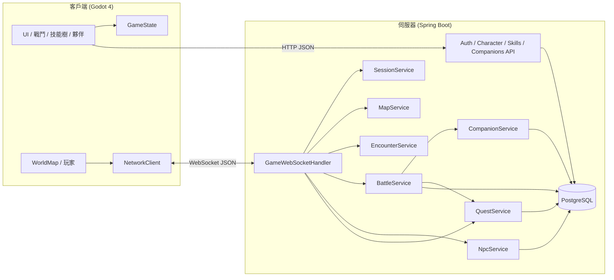

# DeJaBu

2D 等距視角回合制 RPG，採用 **Godot 4 客戶端** + **Java Spring Boot 伺服器** 分離架構。多地圖探索、隨機遇敵、5×2 陣型隊伍戰鬥、元素克制、技能樹、怪物捕捉與夥伴養成、NPC 對話樹、任務系統。

## 架構概覽



| 層級 | 職責 |
|------|------|
| **客戶端** | 等距地圖渲染、輸入、動畫、UI 呈現（登入、創角、技能樹、夥伴、戰鬥、對話、任務日誌） |
| **伺服器** | 帳號驗證、角色與技能持久化、地圖碰撞驗證、傳送、遇敵、戰鬥結算、NPC 對話、任務進度（全部為權威邏輯） |
| **通訊** | REST（登入／創角／技能／夥伴）+ WebSocket（探索／戰鬥）+ JSON 封包 |
| **資料庫** | PostgreSQL 16，Flyway 管理 schema |

## 專案結構

```
DeJaBu/
├── client/                         # Godot 4 客戶端
│   ├── project.godot
│   ├── scenes/
│   │   ├── main.tscn               # 主場景（地圖 + UI + 各面板）
│   │   ├── login_panel.tscn
│   │   ├── character_create_panel.tscn
│   │   ├── skill_tree_panel.tscn
│   │   ├── companion_panel.tscn
│   │   ├── dialogue_panel.tscn     # NPC 對話框
│   │   ├── quest_log_panel.tscn    # 任務日誌
│   │   └── battle.tscn
│   ├── scripts/
│   │   ├── main.gd                 # 遊戲主流程、輸入、訊息分派
│   │   ├── network/network_client.gd
│   │   ├── battle/                 # 戰鬥場景、陣型格、技能施放
│   │   ├── world/                  # 等距地圖、碰撞、傳送、NPC 渲染
│   │   ├── game/
│   │   │   ├── game_state.gd       # 全域狀態（Autoload）
│   │   │   ├── element.gd          # 角色元素
│   │   │   ├── skill_element.gd    # 技能元素
│   │   │   ├── character_stats.gd
│   │   │   └── character_appearance.gd
│   │   └── ui/                     # 登入、創角、技能樹、夥伴、對話、任務面板
│   ├── data/maps/
│   │   ├── maps.json               # 地圖清單、傳送點、NPC 位置
│   │   ├── village.txt
│   │   └── forest.txt
│   └── assets/
│
├── server/                         # Java Spring Boot 伺服器
│   ├── Dockerfile
│   ├── pom.xml
│   └── src/main/
│       ├── java/com/dejebu/
│       │   ├── controller/         # Auth、Character、Skill、Companion REST API
│       │   ├── entity/             # User、Skill、AuthToken、Companion、Npc、Quest 等
│       │   ├── game/               # Element、BattleFormation、SkillCombatCalculator 等
│       │   ├── service/            # Auth、Battle、Skill、Session、Companion、Map、Encounter、Npc、Quest
│       │   └── websocket/
│       ├── resources/
│       │   ├── application.yml
│       │   ├── maps/               # 伺服器端地圖（碰撞與傳送驗證）
│       │   └── db/migration/       # Flyway V1–V19
│       └── logs/
│
├── docker-compose.yml              # PostgreSQL + 伺服器容器
├── start-server.sh
└── README.md
```

## 技術棧

| 元件 | 技術 |
|------|------|
| 客戶端引擎 | Godot 4.3+（專案目標 4.6） |
| 客戶端語言 | GDScript |
| 伺服器框架 | Spring Boot 3.3 |
| 伺服器語言 | Java 17 |
| 資料庫 | PostgreSQL 16 |
| ORM / 遷移 | Spring Data JPA + Flyway |
| 通訊協定 | REST + WebSocket |
| 封包格式 | JSON |
| 容器化 | Docker + Docker Compose |
| 日誌 | Logback（檔案輪轉，不輸出至 Docker stdout） |

## 遊戲機制

### 帳號與角色

- 一個帳號對應一個角色，資料存放在 `users` 表（帳號密碼與角色資料合表）。
- 流程：**註冊／登入**（REST）→ **創建角色**（若尚未創建）→ **WebSocket 登入** → 探索／戰鬥。
- 角色欄位包含：名稱、外型、元素、七項能力值、地圖 ID、地圖座標、等級、技能點、當前 HP。

### 元素（角色）

創角時從五種元素擇一，作為角色的戰鬥屬性：

| 代碼 | 名稱 | 說明 |
|------|------|------|
| `FIRE` | 火 | 玩家可選 |
| `WIND` | 風 | 玩家可選 |
| `EARTH` | 土 | 玩家可選 |
| `THUNDER` | 雷 | 玩家可選 |
| `WATER` | 水 | 玩家可選 |
| `NONE` | 無 | 怪物專用（如幽影），不受克制影響 |

**克制關係**（循環）：火 > 風 > 土 > 雷 > 水 > 火

| 狀態 | 傷害倍率 |
|------|----------|
| 克制（優勢） | ×1.5 |
| 被克（劣勢） | ×0.75 |
| 同屬性／無元素 | ×1.0 |

戰鬥中依攻擊方與防守方元素計算倍率，套用於普攻與技能傷害。

### 能力值

創角時從 0 點基底出發，分配 **10 點**自由點數至七項能力（每項 0–99）：

| 代碼 | 名稱 | 戰鬥用途 |
|------|------|----------|
| `might` | 武力 | 影響普攻傷害區間；技能物理係數 |
| `intelligence` | 智力 | 普攻額外加成（智力 ÷ 5）；技能魔法係數與治療量 |
| `vitality` | 體力 | 最大 HP = 50 + 體力 × 5 |
| `defense` | 防禦 | 減傷；防禦時額外減免 |
| `spirit` | 精神 | 減傷加成 |
| `luck` | 幸運 | 暴擊率（幸運 × 2%）、逃跑成功率、捕捉成功率 |
| `agility` | 敏捷 | 決定行動順序（數值越高越先行動） |

傷害與減傷公式（伺服器 `CharacterStats` 為準）：

- 普攻：`random(武力/2+3 … 武力+9) + 智力/5`
- 減傷：`防禦/4 + 精神/8`（防禦姿態再 + 防禦/2），最低仍受 1 點傷害
- 暴擊：機率 = 幸運 × 2%，傷害 ×2
- 逃跑：成功率上限 85%，基礎 35% + 幸運 × 2%

### 地圖與探索

地圖以 ASCII 文字檔定義，客戶端負責渲染，伺服器負責碰撞與傳送驗證。兩端各有一份地圖檔，修改時需保持同步：

- 客戶端：`client/data/maps/`
- 伺服器：`server/src/main/resources/maps/`

地圖清單與傳送點由 `maps.json` 設定：

```json
{
  "defaultMap": "village",
  "maps": { "village": {...}, "forest": {...} },
  "teleports": {
    "village:12,6": { "map": "forest", "x": 9, "y": 3 },
    "forest:9,3": { "map": "village", "x": 12, "y": 6 }
  },
  "npcs": {
    "village": [{ "id": "village_elder", "name": "村長", "x": 5, "y": 8, "spriteKey": "elder" }],
    "forest":  [{ "id": "forest_merchant", "name": "行商", "x": 12, "y": 5, "spriteKey": "merchant" }]
  }
}
```

| 地圖 ID | 名稱 | 說明 |
|---------|------|------|
| `village` | 新手村 | 起始區域；傳送點 `@` (12, 6) → 森林 |
| `forest` | 幽暗森林 | 樹木較密集；傳送點 `@` (9, 3) → 新手村 |

地圖字元對照：

| 字元 | 地形 | 可走 |
|------|------|------|
| `.` | 草地 | ✅ |
| `P` `=` | 道路／橋 | ✅ |
| `@` | 傳送門（視覺標記，須在 `maps.json` 設定座標才會傳送） | ✅ |
| `#` | 牆壁 | ❌ |
| `T` | 樹木 | ❌ |
| `W` | 水 | ❌ |

**移動**：客戶端先做本地可走性檢查（僅送出可走格子的座標），每次換格向伺服器送 `MOVE`，收到 `MOVE_OK` 後才允許下一步。

**傳送**：踩到 `maps.json` 設定的傳送座標時，`MOVE_OK` 帶 `mapChanged: true`，伺服器更新 DB 中的地圖 ID 與座標，客戶端重新載入地圖。傳送點不觸發遇敵。

**遇敵**：`(x + y) % 5 == 0` 且 `x != 0`、`y != 0` 時觸發，`MOVE_OK` 帶 `encounter: true` 與 `wildMonsters` 預覽資料。**踩到 NPC 格時不觸發遇敵。**

**NPC**：位置由 `maps.json` 的 `npcs` 區塊定義，客戶端在地圖載入時自動渲染人物圖示與名稱標籤。靠近 NPC（Manhattan 距離 ≤ 1）時狀態列顯示 `[F] 與 xxx 對話` 提示。

### NPC 與對話

NPC 定義於資料庫 `npcs` 表，對話樹節點存於 `dialogue_nodes` 表（每個節點的選項以 JSON 陣列儲存）。

**互動流程**

```
靠近 NPC（距離 ≤ 1 格）→ 按 F（或觸發 NPC_INTERACT）
  → 伺服器依玩家任務狀態決定起始節點
    ├─ 有任務可領取  → quest_complete 節點
    ├─ 任務進行中    → quest_already 節點
    └─ 無任務（預設）→ root 節點
  → 客戶端顯示對話框（NPC 名稱 + 文字 + 選項按鈕）
  → 玩家點選選項 → 送出 DIALOGUE_CHOICE
  → 伺服器：執行選項副作用（接受任務 / 領取報酬）→ 回傳下一節點
  → nextKey 為 null → 對話結束，回到探索模式
```

**節點選項 JSON 格式**

```json
[
  { "text": "接受任務（初試身手）", "nextKey": "quest_accepted", "questAccept": 1 },
  { "text": "領取報酬",              "nextKey": null,             "questComplete": 1 },
  { "text": "再見",                  "nextKey": null }
]
```

| 欄位 | 說明 |
|------|------|
| `text` | 選項顯示文字 |
| `nextKey` | 下一個節點 key；`null` 表示對話結束 |
| `questAccept` | 接受指定 ID 的任務 |
| `questComplete` | 領取指定 ID 的任務報酬（需任務進度達標） |

**現有 NPC**

| NPC ID | 名稱 | 地圖 | 座標 | 給予任務 |
|--------|------|------|------|----------|
| `village_elder` | 村長 | 新手村 | (5, 8) | 初試身手 |
| `forest_merchant` | 行商 | 幽暗森林 | (12, 5) | 黑霧調查 |

### 任務系統

任務定義於 `quests` 表，玩家進度存於 `player_quests` 表。

**任務類型**

| 類型 | 觸發進度方式 | 領取報酬方式 |
|------|-------------|-------------|
| `KILL` | 戰鬥勝利後自動統計擊殺的怪物模板 ID | 回到任務給予 NPC 對話，選「領取報酬」 |
| `TALK`（預留） | 與目標 NPC 對話時自動完成 | — |

**任務狀態流程（KILL 任務）**

```
接受任務（IN_PROGRESS, progress=0）
  → 每次戰鬥勝利，伺服器比對 killedTemplateIds，更新 progress
  → progress ≥ requiredCount → 任務「可領取」
  → 回到 NPC 對話，伺服器自動導向 quest_complete 節點
  → 選「領取報酬」→ 發放 EXP + 技能點，status → COMPLETED
```

**現有任務**

| ID | 名稱 | 類型 | 目標 | 數量 | 給予者 | 報酬 |
|----|------|------|------|------|--------|------|
| 1 | 初試身手 | KILL | wild_wolf | 3 | 村長 | 60 EXP + 1 技能點 |
| 2 | 黑霧調查 | KILL | shadow_wisp | 2 | 行商 | 80 EXP + 1 技能點 |

戰鬥勝利時，`BATTLE_RESULT` 帶有 `questProgress` 陣列，客戶端在戰鬥日誌顯示進度提示（含「可回去領取報酬！」訊息）。

### 戰鬥

#### 陣型

雙方各 5×2 共 10 格：

```
[0] [1] [2] [3] [4]   ← 前排
[5] [6] [7] [8] [9]   ← 後排
```

- 玩家固定 **slot 7**（後排中央）。
- 出戰夥伴依序佔 slot **2、6、8、5、9**（前方、左、右、左外、右外），最多 **5 名**。
- 野外遭遇固定生成 3 隻敵人於 slot 0、1、2：**野狼 ×2 + 幽影 ×1**。
- 敵人等級 = 玩家等級 + random(-2 … +3)，最低 1 級。

#### 回合流程

每個回合分為**指定階段**與**執行階段**：

1. **指定階段**：依序為每位存活的我方單位（玩家 + 夥伴）選擇行動；點選陣型格可切換目前指定對象。所有人都指定完後，進入執行。
2. **執行階段（交叉順序）**：**所有存活單位**（敵我雙方）依**敏捷值由高到低**交叉行動；我方執行指定行動，敵方由 AI 即時決策。若行動目標在執行前已被擊倒，自動跳過並提示。執行前會先判定連擊（見下節）。
3. 技能冷卻在本回合所有單位行動後遞減 1 回合。
4. 重複直到一方全滅、成功逃跑，或捕捉導致敵方清空。

#### 連擊

指定階段結束、執行階段開始時，伺服器自動判定是否觸發連擊：

連擊對**雙方**均適用：我方可對敵人發動連擊，敵方亦可對我方發動連擊。

**觸發條件（我方連擊）**

| 條件 | 說明 |
|------|------|
| 相同目標 | 多名我方單位均指定攻擊同一名敵人 |
| 連續行動窗口 | 候選單位在全局行動順序中**必須連續出現**，中間不能穿插任何敵方單位的行動時機 |
| 敏捷相近 | 相鄰候選單位的敏捷差距 ≤ 15 |
| 行動可連擊 | 普攻，或技能的「可連擊」(`combo_eligible`) 欄位為 `true`；同組可混用普攻與技能 |
| 機率 | 每次配對各自 50% 獨立判定（逐對滾動，不一次決定整組） |

> **連續行動窗口**：全局行動順序（含敵我雙方，依敏捷排列）中，若我方 a・b・c 之後輪到敵方行動，再之後才是我方 d・e，則 a/b/c 為一個窗口，d/e 為另一個窗口，**跨窗口的單位不能同組**。敵方連擊窗口同理（我方行動穿插其中即斷開）。

**判定流程**

每個窗口內，同目標的候選單位依**敏捷由高到低**（相同時取 ID 較小者優先）排列後，逐步進行配對判定：

1. 取敏捷最高的尚未分配單位為**候選先手**，與下一個尚未分配單位**嘗試配對**。
   - 敏捷差距 > 15 → 先手單獨行動，跳到下一位重新開始。
   - 差距 ≤ 15，擲 50%：
     - **失敗** → 先手單獨行動；後手從下一個候選者重新判定（不因本次失敗而跳過）。
     - **成功** → 兩人形成連擊組；繼續嘗試將下一個候選者**延伸**加入：
       - 差距 > 15 或候選者耗盡 → 停止延伸。
       - 再擲 50%：**成功** → 加入本組，繼續；**失敗** → 停止延伸，該候選者以剩餘單位為對象**重新開始**新一輪配對。
2. 重複直到所有候選者都被分配（加入某個連擊組，或確定單獨行動）。

> **範例**：全局行動順序為 a b c（我方）→ 敵X → d e（我方），a/b/c 為同攻目標。
> - a+b 判定失敗 → a 獨立；b 以 c 重新判定，成功 → b+c 連擊。
> - 敵X 行動 → 窗口斷開；d/e 開始新窗口判定，成功 → d+e 連擊。
> - 結果：**a 獨立 → b+c 連擊 → 敵X 行動 → d+e 連擊**。

**敵方連擊**

敵方單位也會依相同規則（窗口 + 逐對判定）嘗試連擊。敵方無需預先指定目標，連擊組形成時由組長隨機選擇一名我方存活單位作為共同目標，所有成員依序攻擊同一人。

**執行方式**

- 觸發後，連擊組中**敏捷最高者**作為**先手**，其餘成員依敏捷順序緊接在先手的行動時機**一起出手**；各成員的個人行動回合自動略過。
- 所有成員的傷害均 ×1.1（套用於元素克制後的最終傷害，向下取整）。
- **每人獨立計算傷害**，傷害各自顯示，不做加總。
- **目標死亡不中斷後續成員**：即使連擊中途目標已倒地，剩餘成員仍繼續出手（傷害溢出，目標 HP 可降至負值，但對戰局沒有額外效果）。
- 連擊期間所有成員共享擊殺判定：只要目標在連擊過程中死亡，所有參與者均獲得擊殺獎勵 EXP。
- 戰鬥訊息格式：`【N人連擊】A・B・C 對 X 發動連擊！`

#### 行動

| 行動 | 按鍵 | 誰可用 | 說明 |
|------|------|--------|------|
| 攻擊 | `1` → 點敵 | 全員 | 單體普攻 |
| 防禦 | `2` | 全員 | 本回合額外減傷 |
| 逃跑 | `3` | 全員 | 依行動者幸運值判定；執行時成功則立即結束戰鬥 |
| 捕捉 | `4` → 點敵 | 僅玩家 | 對可捕捉敵人嘗試捕捉；失敗浪費該回合 |
| 技能 | 點技能鈕 → 點目標 | 有學會技能的單位 | 依目標陣營／範圍選擇；受冷卻限制 |
| 取消選目標 | `Esc` | — | 取消攻擊／捕捉／技能選擇 |

**敵方 AI**：55% 機率優先使用隨機可用技能，否則普攻；攻擊對象為隨機存活我方單位。

#### 技能傷害與治療

- 傷害：`(武力係數 × 武力 + 智力係數 × 智力) × (1 + 0.15 × (等級-1))` + 小幅隨機，再套用元素克制。
- 治療（如治療術）：`智力係數 × 智力 × 等級倍率 × 0.9`，最低 5 點。
- 技能元素為 `UNIVERSAL` 時，以施放者角色元素計算克制。

#### 勝負與結算

| 結果 | 條件 | 效果 |
|------|------|------|
| 勝利 | 敵方全滅 | 按怪物分配 EXP（見下節）；達標自動升級 |
| 敗北 | 我方全滅 | 戰鬥結束；玩家 HP 以 1 存檔 |
| 逃跑 | 逃跑成功 | 戰鬥結束，無獎勵 |
| 捕捉 | 捕捉成功 | 敵人離場，建立夥伴紀錄 |

- 玩家 HP **跨戰鬥持久化**；下次遭遇以當前剩餘 HP 進入戰鬥。
- 敗戰時 HP 存為 1（保底），避免永久無法戰鬥。
- 夥伴 HP 戰後同步至 DB；HP 為 0 的夥伴不參戰。

### 經驗值與升級

| 項目 | 數值 |
|------|------|
| 起始等級 | 1 |
| 起始技能點 | 10 |
| 每隻怪物 EXP | 怪物等級 × 5 |
| 升級門檻 | 當前等級 × 100 EXP |
| 玩家升級獎勵 | +2 技能點 |
| 最高等級 | 99 |

升級在勝利結算時自動判定，可一次連升多級（EXP 足夠的情況下）。

#### EXP 分配方式

每隻被擊倒的怪物**單獨計算**，勝利時統一發放：

```
怪物 EXP = 怪物等級 × 5
共享部分 = floor(怪物 EXP × 0.75)   → 所有我方單位（含玩家與夥伴）各自獲得
擊殺獎勵 = 怪物 EXP − 共享部分      → 僅發給擊殺該怪物的單位
```

- **一般擊殺**：擊殺者獲得「共享部分 + 擊殺獎勵」，其他人只獲得共享部分。
- **連擊擊殺**：所有參與連擊的成員各自都能取得完整擊殺獎勵（不分攤，人數不限）。
- **範例**（怪物 Lv.10，EXP = 50）：共享部分 = floor(37.5) = 37；擊殺獎勵 = 13；擊殺者得 50，其餘人各得 37。

夥伴同樣會累積 EXP 並自動升級，升級後各能力值依怪物成長表提升（見「夥伴養成」一節）。

### 技能

技能定義於 `skills` 表，角色已學技能存於 `user_skills` 表。

**技能屬性**

| 欄位 | 說明 |
|------|------|
| 名稱 | 技能顯示名稱 |
| 元素 | 火／風／土／雷／水／**通用**（`SkillElement`，與角色元素分開） |
| 武力係數 | 物理向係數 |
| 智力係數 | 魔法向係數 |
| 需求等級 | 角色等級須達標才能學習 |
| 最大等級 | 技能可升到的等級上限 |
| 冷卻回合 | 使用後需等待的回合數 |
| 目標陣營 | `ALLY` 我方／`ENEMY` 敵方／`ANY` 皆可 |
| 目標範圍 | `SINGLE` 一人／`ROW_ADJACENT_THREE` 一行相鄰三人／`CROSS` 十字／`ROW` 一整行／`ALL` 全部 |
| 可連擊 | 布林值，預設 `true`；`false` 時此技能不計入連擊判定 |
| 前置技能 | 多對多關係，須先學會所有前置 |

**角色技能相關**

| 欄位 | 說明 |
|------|------|
| 技能等級 | 該角色此技能的目前等級（初學為 1） |
| 技能點 | 起始 10 點，升級後每級 +2；學習或升級各消耗 1 點 |
| 角色等級 | 擊敗敵人累積 EXP 自動升級，用於解鎖技能需求等級 |

**學習規則**

1. 尚未學過該技能
2. 角色等級 ≥ 技能需求等級
3. 所有前置技能已學會
4. 技能點 ≥ 1

**升級規則**

1. 已學會該技能
2. 目前等級 < 最大等級
3. 技能點 ≥ 1

**技能樹**（V10 seed 資料）

```
第 1 階          第 2 階              第 3 階
基礎劍術 ──→ 重劈 ──→ 連斬
              ╲
基礎法術 ──→ 火球術 ──→ 烈焰
         │     ╲
         │      ╲──→ 隕石（需火球術 + 重劈）
         └──→ 治療術
```

| 技能 | 元素 | 目標 | 範圍 | 冷卻 |
|------|------|------|------|------|
| 基礎劍術 | 通用 | 敵方 | 單體 | 0 |
| 基礎法術 | 通用 | 任意 | 單體 | 0 |
| 火球術 | 火 | 敵方 | 單體 | 1 |
| 重劈 | 通用 | 敵方 | 單體 | 2 |
| 治療術 | 水 | 我方 | 單體 | 3 |
| 烈焰 | 火 | 敵方 | 整行 | 2 |
| 連斬 | 通用 | 敵方 | 一行相鄰三人 | 1 |
| 隕石 | 火 | 敵方 | 全體 | 4 |

玩家與出戰夥伴均可在戰鬥中施放已學技能；範圍由 `SkillTargetResolver` 依 5×2 陣型格解析。

### 夥伴與捕捉

野外怪物定義於 `monster_templates` 表，捕捉後存入 `user_companions` 表。

| 模板 ID | 名稱 | 元素 | 可捕捉 | 預設技能 |
|---------|------|------|--------|----------|
| `wild_wolf` | 野狼 | 風 | ✅ | 基礎劍術、重劈 |
| `shadow_wisp` | 幽影 | 無 | ✅ | 基礎法術、火球術 |

**捕捉條件**

- 僅玩家可發動。
- 目標須為可捕捉怪物。
- 等級差距 ≤ 10 級。

**捕捉成功率**

```
成功率 = 0.18 + hpFactor×0.52 + 幸運×0.008 - 等級差×0.015
hpFactor = 1 - 當前HP/最大HP（血量越低越容易）
最終 clamp 至 5%–92%
```

失敗時浪費該回合。成功後怪物依模板複製能力值與技能，若出戰名額未滿則自動加入隊伍。

**隊伍管理**

- 最多 5 名夥伴同時出戰，透過夥伴面板（`P` 或 UI 按鈕）以 REST 切換。
- 夥伴技能可用主人的技能點升級（`/api/companions/skills/upgrade`）。
- 夥伴在戰鬥中可攻擊、防禦、逃跑、施放技能，但**不能捕捉**。

**夥伴養成**

夥伴和玩家一樣可以透過戰鬥獲得 EXP 並自動升級（同樣使用「等級 × 100」門檻）：

| 能力值 | 每升一級成長 |
|--------|-------------|
| 武力 | +2 |
| 智力 | +1 |
| 體力 | +2（最大 HP 同步更新） |
| 防禦 | +1 |
| 精神 | +1 |
| 幸運 | +1 |
| 敏捷 | +1 |

夥伴升級資訊會附在 `BATTLE_RESULT` 的 `companionExpResults` 陣列中回傳。

### 外型

創角時五種外型代碼（`STYLE_1` … `STYLE_5`），客戶端以不同色調顯示同一 sprite。

### 尚未實作

- 道具、裝備、金幣、背包
- 多人同地圖可見（伺服器僅追蹤連線數，無位置廣播）

## 客戶端模組說明

### Autoload 單例

- **NetworkClient** — 管理 WebSocket 連線，負責送收 JSON 封包
- **GameState** — 保存 token、玩家名稱、座標、地圖、元素、能力、技能點、探索／戰鬥／對話模式、任務列表等

### 世界地圖（WorldMap）

- 從 `data/maps/*.txt` 讀取 ASCII 地圖，以等距投影渲染（`iso_coords.gd`、`iso_ground_renderer.gd`）
- 地形烘焙為貼圖，樹木／牆壁／傳送門以 sprite 呈現
- NPC 根據 `maps.json` 的 `npcs` 區塊自動渲染為人物圖示 + 名稱標籤
- 提供 `is_walkable()`、`grid_to_world()` 等格子座標轉換
- 透過 `map_registry.gd` 讀取 `maps.json` 管理多地圖切換，`get_adjacent_npc()` 偵測相鄰 NPC

### 遊戲流程

```
啟動 → REST 登入／註冊 →（首次）REST 創建角色
  → WebSocket 登入 → 探索模式（WASD / 點擊移動）
    → 開啟技能樹（K）→ REST 查詢／學習／升級技能
    → 開啟夥伴面板（P）→ REST 管理出戰隊伍／升級夥伴技能
    → 開啟任務日誌（J 或 UI 按鈕）→ 查看進行中任務
    → 靠近 NPC → 按 F 對話 → 接受任務
    → 遇敵 → 戰鬥模式（指定所有單位行動 → 依敏捷交叉執行）
      → 結算（EXP、升級、任務進度）→ 回到探索
    → 回 NPC 對話 → 任務進度達標時可選「領取報酬」
```

## 伺服器模組說明

### REST API

| 方法 | 路徑 | 說明 |
|------|------|------|
| `GET` | `/api/auth/health` | 健康檢查 |
| `POST` | `/api/auth/register` | 註冊 |
| `POST` | `/api/auth/login` | 登入，回傳 token |
| `POST` | `/api/character/create` | 創建角色（需 token） |
| `POST` | `/api/skills/tree` | 取得技能樹與學習狀態（需 token） |
| `POST` | `/api/skills/learn` | 學習技能（需 token、`skillId`） |
| `POST` | `/api/skills/upgrade` | 升級技能（需 token、`skillId`） |
| `POST` | `/api/companions/list` | 取得夥伴列表（需 token） |
| `POST` | `/api/companions/party` | 切換夥伴出戰狀態（需 token、`companionId`、`active`） |
| `POST` | `/api/companions/skills/upgrade` | 升級夥伴技能（需 token、`companionId`、`skillId`） |

認證方式：請求 body 帶 `token`（UUID，登入後取得）。

### WebSocket 端點

```
ws://localhost:8080/ws/game
```

### 封包類型（MessageType）

| 方向 | type | 說明 |
|------|------|------|
| C→S | `LOGIN` | 登入，帶 `token` |
| C→S | `MOVE` | 移動，帶 `x`、`y`、`direction`、`mapId` |
| C→S | `BATTLE_START` | 開始戰鬥 |
| C→S | `BATTLE_ACTION` | 戰鬥指令（`attack`／`defend`／`flee`／`capture`／`skill`） |
| C→S | `NPC_INTERACT` | 與 NPC 開始對話，帶 `npcId`、`mapId` |
| C→S | `DIALOGUE_CHOICE` | 選擇對話選項，帶 `npcId`、`nodeKey`、`choiceIndex` |
| C→S | `QUEST_LIST` | 取得目前任務日誌 |
| C→S | `PING` | 心跳 |
| S→C | `LOGIN_OK` | 登入成功，回傳角色座標、地圖、元素、能力、HP 等 |
| S→C | `MOVE_OK` | 移動確認，可能帶 `encounter`、`mapChanged`、`wildMonsters` |
| S→C | `BATTLE_START` | 戰鬥開始，回傳雙方陣型、HP、元素、技能 |
| S→C | `BATTLE_RESULT` | 回合結算；勝利時帶 `questProgress` 陣列 |
| S→C | `NPC_INTERACT_OK` | 對話節點（`finished: false`）或對話結束（`finished: true`）；帶 `questRewards` |
| S→C | `QUEST_LIST_OK` | 玩家任務列表 |
| S→C | `PONG` | 心跳回應 |
| S→C | `ERROR` | 錯誤訊息 |

`BATTLE_ACTION` 額外欄位：`actorId`（行動單位）、`targetId`（目標格）、`skillId`（技能施放時）。

`BATTLE_RESULT` 當 `roundExecuted: false` 時僅更新 `battle.plannedActorIds`；`roundExecuted: true` 時包含完整 `attackEvents`、`message`、`battleOver`，勝利時附帶 `expGained`、`playerLevel`、`questProgress: [{questName, progress, requiredCount, readyToClaim}]`，若有夥伴獲得 EXP 則附帶 `companionExpResults: [{companionId, name, expGained, previousLevel, newLevel, leveledUp}]`。

`NPC_INTERACT_OK` 對話進行中欄位：`npcId`、`npcName`、`nodeKey`、`text`、`choices: [{index, text}]`；對話結束（`finished: true`）時帶 `message` 與 `questRewards: [{questName, expGained, skillPointsGained}]`。

### 服務分層

- **AuthService** — 註冊、登入、token 驗證、創建角色、HP 同步
- **SkillService** — 技能樹查詢、學習、升級
- **CompanionService** — 夥伴列表、出戰管理、捕捉結算、夥伴技能升級、HP 同步
- **MapService** — 地圖載入、可走性驗證、傳送點解析
- **EncounterService** — 野外遭遇生成與暫存
- **SessionService** — WebSocket session 與玩家管理
- **BattleService** — 回合制戰鬥邏輯（指定→執行兩段式、傷害、元素克制、技能、捕捉、勝負、EXP 結算、勝利時附帶 killedTemplateIds）
- **ProgressionService** — EXP 計算、升級判定、技能點發放
- **NpcService** — NPC 互動、對話樹節點解析、依任務狀態動態決定起始節點、任務接受／報酬觸發
- **QuestService** — 任務接受、擊殺進度記錄、報酬發放、任務日誌查詢
- **GameWebSocketHandler** — 封包解析與路由

### 資料表（摘要）

| 表 | 用途 |
|----|------|
| `users` | 帳號、角色、能力值、等級、EXP、技能點、當前 HP、座標、地圖 ID |
| `auth_tokens` | 登入 session token |
| `skills` | 技能定義（含 `combo_eligible` 欄位） |
| `skill_prerequisites` | 技能前置關係 |
| `user_skills` | 角色已學技能與等級 |
| `monster_templates` | 野外怪物模板 |
| `monster_template_skills` | 怪物模板預設技能 |
| `user_companions` | 已捕捉夥伴與出戰狀態（含 `exp` 欄位，支援升級） |
| `companion_skills` | 夥伴已學技能與等級 |
| `npcs` | NPC 定義（地圖 ID、格子座標、名稱、起始對話節點） |
| `dialogue_nodes` | 對話樹節點（文字 + 選項 JSON） |
| `quests` | 任務定義（類型、目標、所需數量、報酬、給予者 NPC） |
| `player_quests` | 玩家任務進度（狀態、進度值） |

## 快速開始

### 前置需求

- [Docker Desktop](https://www.docker.com/products/docker-desktop/)（伺服器 + PostgreSQL）
- [Godot 4.3+](https://godotengine.org/download)（客戶端）

### 1. 啟動伺服器

```bash
./start-server.sh
```

預設行為：停止舊容器 → 重新編譯 → 背景啟動（含 PostgreSQL 與 Flyway 遷移）。

其他指令：

```bash
./start-server.sh stop      # 停止
./start-server.sh logs      # 查看 logback 日誌
./start-server.sh status    # 查看容器狀態
```

### 2. 啟動客戶端

1. 用 Godot 開啟 `client/project.godot`
2. 按 **F5** 執行

### 3. 操作

| 模式 | 按鍵 |
|------|------|
| 探索移動 | WASD 或方向鍵；滑鼠左鍵點擊 |
| 技能樹 | 畫面「技能」按鈕或 `K` |
| 夥伴面板 | 畫面「夥伴」按鈕或 `P` |
| 任務日誌 | 畫面「任務」按鈕或 `J` |
| 與 NPC 對話 | 靠近 NPC 後按 `F` |
| 攻擊 | `1` → 點選敵方單位 |
| 防禦 | `2` |
| 逃跑 | `3` |
| 捕捉 | `4` → 點選敵方單位（僅玩家） |
| 技能 | 點選技能按鈕 → 點選目標 |
| 取消選目標 | `Esc` |

## 日誌位置

伺服器日誌透過 Logback 寫入專案目錄（非系統根目錄）：

```
server/src/main/logs/dejebu-server.log
```

Docker 容器透過 volume 掛載此目錄，並停用 Docker 自身的 log driver。

## 開發備註

- 客戶端 WebSocket 位址：`client/scripts/network/network_client.gd` 的 `SERVER_URL`
- REST API 位址：各 UI 面板腳本內的 `http://localhost:8080/api/...`
- 遇敵規則由伺服器判定（`x + y` 為 5 的倍數且非原點）；傳送點與 NPC 格不觸發遇敵
- 移動與碰撞以伺服器 `MapService` 為準，客戶端僅送出本地判定為可走的格子
- 戰鬥邏輯以伺服器為準，客戶端僅負責顯示與輸入
- 技能學習／升級以 REST 為準；戰鬥技能施放以 WebSocket 為準
- 新增 NPC：同時在 `maps.json`（`npcs` 區塊）與資料庫 `V17__npc_quest.sql`（或新 migration）新增記錄
- 新增任務：在 migration 中插入 `quests` 與 `dialogue_nodes` 記錄（對話節點 `questAccept`／`questComplete` 欄位指定任務 ID）
- 地圖修改：同時編輯客戶端與伺服器兩份 `.txt`，並在 `maps.json` 設定傳送點後重啟
- Schema 變更：新增 Flyway migration 至 `server/src/main/resources/db/migration/`（目前最新為 V19）

## 後續規劃方向

- [ ] 道具、裝備、商店
- [ ] 更豐富的任務類型（TALK、FETCH、多段任務鏈）
- [ ] 多人同地圖可見
