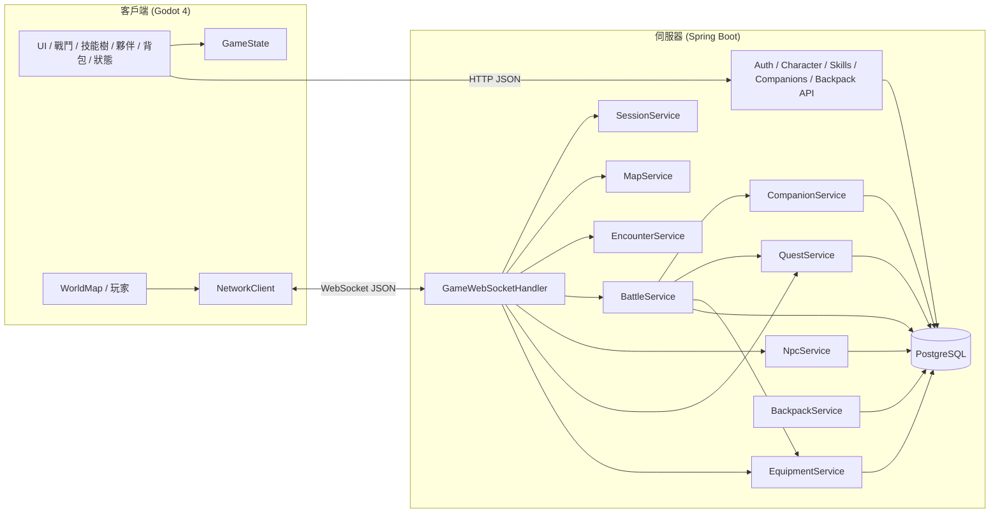

# DeJaBu

2D 等距視角回合制 RPG，採用 **Godot 4 客戶端** + **Java Spring Boot 伺服器** 分離架構。多地圖探索、隨機遇敵、5×2 陣型隊伍戰鬥、元素克制、技能樹、怪物捕捉與夥伴養成、**醫館與死亡機制**（陣亡扣 EXP、傳送醫館；夥伴戰力耗盡需休養後至醫館治療）、NPC 對話樹、任務系統、背包與裝備系統（支援角色與夥伴裝備管理）、消耗道具系統（可疊加最多 999 個 / 堆，超過自動分堆）、**戰鬥中使用消耗道具**、**F1–F12 技能快捷鍵**（每個角色 / 夥伴獨立設定）、**Shift+F1–F12 道具快捷鍵**（所有人共用），以及可查看角色與所有夥伴完整數值的**狀態選單**（`C` 鍵）。

## 架構概覽



| 層級 | 職責 |
|------|------|
| **客戶端** | 等距地圖渲染、輸入、動畫、UI 呈現（登入、創角、技能樹、夥伴、戰鬥、對話、任務日誌、背包管理、狀態選單） |
| **伺服器** | 帳號驗證、角色與技能持久化、地圖碰撞驗證、傳送、遇敵、戰鬥結算、死亡／醫館機制、NPC 對話、任務進度、背包與裝備管理（全部為權威邏輯） |
| **通訊** | REST（登入／創角／技能／夥伴／背包）+ WebSocket（探索／戰鬥）+ JSON 封包 |
| **資料庫** | PostgreSQL 16，Flyway 管理 schema |

## 專案結構

```
DeJaBu/
├── client/                         # Godot 4 客戶端
│   ├── project.godot
│   ├── scenes/
│   │   ├── main.tscn               # 主場景（地圖 + UI + 各面板）
│   │   ├── login_panel.tscn
│   │   ├── character_create_panel.tscn
│   │   ├── skill_tree_panel.tscn
│   │   ├── companion_panel.tscn
│   │   ├── dialogue_panel.tscn     # NPC 對話框
│   │   ├── quest_log_panel.tscn    # 任務日誌
│   │   ├── equipment_panel.tscn    # 背包（裝備管理）
│   │   ├── status_panel.tscn       # 狀態選單（角色與夥伴數值）
│   │   └── battle.tscn
│   ├── scripts/
│   │   ├── main.gd                 # 遊戲主流程、輸入、訊息分派
│   │   ├── network/network_client.gd
│   │   ├── battle/                 # 戰鬥場景、陣型格、技能施放
│   │   ├── world/                  # 等距地圖、碰撞、傳送、NPC 渲染
│   │   ├── game/
│   │   │   ├── game_state.gd       # 全域狀態（Autoload）
│   │   │   ├── element.gd          # 角色元素
│   │   │   ├── skill_element.gd    # 技能元素
│   │   │   ├── character_stats.gd
│   │   │   └── character_appearance.gd
│   │   └── ui/                     # 登入、創角、技能樹、夥伴、對話、任務、背包、狀態面板
│   ├── data/maps/
│   │   ├── maps.json               # 地圖清單、傳送點、NPC 位置
│   │   ├── village.txt
│   │   └── forest.txt
│   └── assets/
│
├── server/                         # Java Spring Boot 伺服器
│   ├── Dockerfile
│   ├── pom.xml
│   └── src/main/
│       ├── java/com/dejebu/
│       │   ├── controller/         # Auth、Character、Skill、Companion、Backpack REST API
│       │   ├── entity/             # User、Skill、AuthToken、Companion、Npc、Quest、Item、UserEquipment、UserInventory、CompanionEquipment 等
│       │   ├── game/               # Element、EquipmentSlot、ItemType、BattleFormation、SkillCombatCalculator 等
│       │   ├── service/            # Auth、Battle、Skill、Session、Companion、Map、Encounter、Npc、Quest、Equipment、Backpack
│       │   └── websocket/
│       ├── resources/
│       │   ├── application.yml
│       │   ├── maps/               # 伺服器端地圖（碰撞與傳送驗證）
│       │   └── db/migration/       # Flyway V1–V21
│       └── logs/
│
├── docker-compose.yml              # PostgreSQL + 伺服器容器
├── start-server.sh
└── README.md
```

## 技術棧

| 元件 | 技術 |
|------|------|
| 客戶端引擎 | Godot 4.3+（專案目標 4.6） |
| 客戶端語言 | GDScript |
| 伺服器框架 | Spring Boot 3.3 |
| 伺服器語言 | Java 17 |
| 資料庫 | PostgreSQL 16 |
| ORM / 遷移 | Spring Data JPA + Flyway |
| 通訊協定 | REST + WebSocket |
| 封包格式 | JSON |
| 容器化 | Docker + Docker Compose |
| 日誌 | Logback（檔案輪轉，不輸出至 Docker stdout） |

## 遊戲機制

### 帳號與角色

- 一個帳號對應一個角色，資料存放在 `users` 表（帳號密碼與角色資料合表）。
- 流程：**註冊／登入**（REST）→ **創建角色**（若尚未創建）→ **WebSocket 登入** → 探索／戰鬥。
- 角色欄位包含：名稱、外型、元素、七項能力值、地圖 ID、地圖座標、等級、技能點、當前 HP。

### 元素（角色）

創角時從五種元素擇一，作為角色的戰鬥屬性：

| 代碼 | 名稱 | 說明 |
|------|------|------|
| `FIRE` | 火 | 玩家可選 |
| `WIND` | 風 | 玩家可選 |
| `EARTH` | 土 | 玩家可選 |
| `THUNDER` | 雷 | 玩家可選 |
| `WATER` | 水 | 玩家可選 |
| `NONE` | 無 | 怪物專用（如幽影），不受克制影響 |

**克制關係**（循環）：火 > 風 > 土 > 雷 > 水 > 火

| 狀態 | 傷害倍率 |
|------|----------|
| 克制（優勢） | ×1.5 |
| 被克（劣勢） | ×0.75 |
| 同屬性／無元素 | ×1.0 |

戰鬥中依攻擊方與防守方元素計算倍率，套用於普攻與技能傷害。

### 能力值

創角時從 0 點基底出發，分配 **10 點**自由點數至七項能力（每項 ≥ 0，無上限）：

| 代碼 | 名稱 | 戰鬥用途 |
|------|------|----------|
| `might` | 武力 | 普攻傷害（每 1 點 +1）；技能武力係數 |
| `intelligence` | 智力 | 技能智力係數與治療量 |
| `vitality` | 體力 | 最大 HP = 體力 × 20 |
| `defense` | 防禦 | 減傷（每 1 點 -1）；防禦姿態再 -防禦 |
| `spirit` | 精神 | 最大 MP = 精神 × 5 |
| `luck` | 幸運 | 暴擊率（攻方幸運 − 守方幸運，每 1 點差 +1%）、逃跑成功率、捕捉成功率 |
| `agility` | 敏捷 | 決定行動順序（數值越高越先行動）；連擊配對判斷 |

傷害與減傷公式（伺服器 `CharacterStats` 為準）：

- 最大 HP：`體力 × 20`；最大 MP：`精神 × 5`
- 普攻：`max(1, 武力)`，再套用元素克制
- 減傷：`防禦`（防禦姿態再 + 防禦），最低仍受 1 點傷害
- 暴擊：機率 = `max(0, 攻方幸運 − 守方幸運)%`，傷害 ×2
- 逃跑：成功率上限 85%，基礎 35% + 幸運 × 2%

### 地圖與探索

地圖以 ASCII 文字檔定義，客戶端負責渲染，伺服器負責碰撞與傳送驗證。兩端各有一份地圖檔，修改時需保持同步：

- 客戶端：`client/data/maps/`
- 伺服器：`server/src/main/resources/maps/`

地圖清單與傳送點由 `maps.json` 設定：

```json
{
  "defaultMap": "village",
  "maps": { "village": {...}, "forest": {...} },
  "teleports": {
    "village:12,6": { "map": "forest", "x": 9, "y": 3 },
    "forest:9,3": { "map": "village", "x": 12, "y": 6 }
  },
  "npcs": {
    "village": [{ "id": "village_elder", "name": "村長", "x": 5, "y": 8, "spriteKey": "elder" }],
    "forest":  [{ "id": "forest_merchant", "name": "行商", "x": 12, "y": 5, "spriteKey": "merchant" }]
  }
}
```

| 地圖 ID | 名稱 | 說明 |
|---------|------|------|
| `village` | 新手村 | 起始區域；傳送點 `@` (12, 6) → 森林 |
| `forest` | 幽暗森林 | 樹木較密集；傳送點 `@` (9, 3) → 新手村 |

地圖字元對照：

| 字元 | 地形 | 可走 |
|------|------|------|
| `.` | 草地 | ✅ |
| `P` `=` | 道路／橋 | ✅ |
| `@` | 傳送門（視覺標記，須在 `maps.json` 設定座標才會傳送） | ✅ |
| `#` | 牆壁 | ❌ |
| `T` | 樹木 | ❌ |
| `W` | 水 | ❌ |

**移動**：客戶端先做本地可走性檢查（僅送出可走格子的座標），每次換格向伺服器送 `MOVE`，收到 `MOVE_OK` 後才允許下一步。

**傳送**：踩到 `maps.json` 設定的傳送座標時，`MOVE_OK` 帶 `mapChanged: true`，伺服器更新 DB 中的地圖 ID 與座標，客戶端重新載入地圖。傳送點不觸發遇敵。

**遇敵**：`(x + y) % 5 == 0` 且 `x != 0`、`y != 0` 時觸發，`MOVE_OK` 帶 `encounter: true` 與 `wildMonsters` 預覽資料。**踩到 NPC 格時不觸發遇敵。**

**NPC**：位置由 `maps.json` 的 `npcs` 區塊定義，客戶端在地圖載入時自動渲染人物圖示與名稱標籤。靠近 NPC（Manhattan 距離 ≤ 1）時狀態列顯示 `[F] 與 xxx 對話` 提示。

### NPC 與對話

NPC 定義於資料庫 `npcs` 表，對話樹節點存於 `dialogue_nodes` 表（每個節點的選項以 JSON 陣列儲存）。

**互動流程**

```
靠近 NPC（距離 ≤ 1 格）→ 按 F（或觸發 NPC_INTERACT）
  → 伺服器依玩家任務狀態決定起始節點
    ├─ 有任務可領取  → quest_complete 節點
    ├─ 任務進行中    → quest_already 節點
    └─ 無任務（預設）→ root 節點
  → 客戶端顯示對話框（NPC 名稱 + 文字 + 選項按鈕）
  → 玩家點選選項 → 送出 DIALOGUE_CHOICE
  → 伺服器：執行選項副作用（接受任務 / 領取報酬）→ 回傳下一節點
  → nextKey 為 null → 對話結束，回到探索模式
```

**節點選項 JSON 格式**

```json
[
  { "text": "接受任務（初試身手）", "nextKey": "quest_accepted", "questAccept": 1 },
  { "text": "領取報酬",              "nextKey": null,             "questComplete": 1 },
  { "text": "再見",                  "nextKey": null }
]
```

| 欄位 | 說明 |
|------|------|
| `text` | 選項顯示文字 |
| `nextKey` | 下一個節點 key；`null` 表示對話結束 |
| `action` | 特殊動作：`open_shop` 開啟商店；`hospital_revive` 於醫館治療夥伴（設定此欄時通常不需 `nextKey`） |
| `questAccept` | 接受指定 ID 的任務 |
| `questComplete` | 領取指定 ID 的任務報酬（需任務進度達標） |

**現有 NPC**

| NPC ID | 名稱 | 地圖 | 座標 | 角色 | 備註 |
|--------|------|------|------|------|------|
| `village_elder` | 村長 | 新手村 | (5, 8) | 任務 | 給予「初試身手」 |
| `village_healer` | 村醫 | 新手村 | (4, 11) | 醫館 | 可對話「治療夥伴」 |
| `forest_merchant` | 行商 | 幽暗森林 | (12, 5) | 任務／商店 | 給予「黑霧調查」 |
| `forest_healer` | 森林醫師 | 幽暗森林 | (5, 10) | 醫館 | 可對話「治療夥伴」 |

**醫館位置（死亡傳送目標）**

| 醫館 ID | 名稱 | 地圖 | 復活座標 |
|---------|------|------|----------|
| `village_hospital` | 新手村醫館 | 新手村 | (5, 11) |
| `forest_hospital` | 森林醫館 | 幽暗森林 | (6, 10) |

陣亡時伺服器依玩家當前地圖選擇**最近醫館**（同地圖優先）並更新座標。

### 任務系統

任務定義於 `quests` 表，玩家進度存於 `player_quests` 表。

**任務類型**

| 類型 | 觸發進度方式 | 領取報酬方式 |
|------|-------------|-------------|
| `KILL` | 戰鬥勝利後自動統計擊殺的怪物模板 ID | 回到任務給予 NPC 對話，選「領取報酬」 |
| `TALK`（預留） | 與目標 NPC 對話時自動完成 | — |

**任務狀態流程（KILL 任務）**

```
接受任務（IN_PROGRESS, progress=0）
  → 每次戰鬥勝利，伺服器比對 killedTemplateIds，更新 progress
  → progress ≥ requiredCount → 任務「可領取」
  → 回到 NPC 對話，伺服器自動導向 quest_complete 節點
  → 選「領取報酬」→ 發放 EXP + 技能點，status → COMPLETED
```

**現有任務**

| ID | 名稱 | 類型 | 目標 | 數量 | 給予者 | 報酬 |
|----|------|------|------|------|--------|------|
| 1 | 初試身手 | KILL | wild_wolf | 3 | 村長 | 60 EXP + 1 技能點 |
| 2 | 黑霧調查 | KILL | shadow_wisp | 2 | 行商 | 80 EXP + 1 技能點 |

戰鬥勝利時，`BATTLE_RESULT` 帶有 `questProgress` 陣列，客戶端在戰鬥日誌顯示進度提示（含「可回去領取報酬！」訊息）。

### 背包與裝備系統

道具定義於 `items` 表，分為兩種類型（`item_type`）：

| 類型 | 說明 | 堆疊 |
|------|------|------|
| `EQUIPMENT` | 可裝備於部位的裝備 | ❌ 不可堆疊 |
| `CONSUMABLE` | 消耗道具，使用一次減少 1 個 | ✅ 每堆上限 999，超過自動分堆 |

#### 背包（user_inventory）

玩家持有但**未裝備**的道具存於 `user_inventory`（代理主鍵 `id BIGSERIAL`，含 `user_id`、`item_id`、`quantity` 欄位）。

同一種道具可以有多筆列（多個堆疊），每堆 `quantity` 上限 999（DB CHECK 約束）。伺服器加入道具時優先填滿未滿堆，滿了才開新堆；使用或裝備時從第一個找到的堆扣除。

- 裝備時：從背包取出一個，移入 `user_equipment`；若同部位已有裝備則自動卸下並**歸還背包**。
- 卸下時：從 `user_equipment` 移除，放回背包。
- 使用消耗道具：消耗一個，套用效果（如回復 HP）。
- V21 遷移自動給所有現有玩家所有 Lv.1 裝備（未裝備者放入背包）。

#### 裝備部位

| 代碼 | 名稱 |
|------|------|
| `HEAD` | 頭 |
| `FACE` | 臉 |
| `SHOULDER` | 肩 |
| `HAND` | 手 |
| `BODY` | 身 |
| `LEG` | 腿 |
| `FOOT` | 腳 |
| `BACK` | 背部 |
| `ACCESSORY` | 飾品 |

#### 裝備屬性

每件裝備可提升七項能力值的任意組合（`bonus_might`、`bonus_intelligence`、`bonus_vitality`、`bonus_defense`、`bonus_spirit`、`bonus_luck`、`bonus_agility`），加成無上限，直接疊加至基礎能力值。

#### 夥伴裝備（companion_equipment）

夥伴也可以穿戴裝備，裝備記錄於 `companion_equipment`（主鍵：`companion_id + slot`）。裝備與卸下的邏輯和角色相同——裝備從玩家背包取出，卸下後歸還玩家背包。夥伴等級不足時無法裝備。

#### 裝備對戰鬥的影響

進入戰鬥時，伺服器在 `GameWebSocketHandler` 中將玩家的**基礎能力值**加上所有已裝備道具的**加成合計**，以最終能力值建立 `BattleUnit`，並傳入 `BattleService`。夥伴則在 `CompanionService.loadPartyBattleUnits` 中同樣合併 `companion_equipment` 加成。裝備加成對以下所有戰鬥計算均有效：普攻傷害、減傷、技能傷害、暴擊率、逃跑率、最大 HP／MP。

#### 消耗道具（V22 seed）

| 道具 | 效果 | 說明 |
|------|------|------|
| 小型草藥 | 恢復 20 HP | V22 起初始給玩家 5 個 |
| 中型草藥 | 恢復 50 HP | — |
| 大型草藥 | 恢復 120 HP | — |

使用上限以玩家**當前最大 HP**為準，不能超量恢復。

#### 初始道具（V20 seed）

每個部位各提供 2 件道具（需求 Lv.1 與 Lv.5 各一），共 18 件：

| 部位 | Lv.1 道具 | Lv.5 道具 |
|------|-----------|-----------|
| 頭 | 皮革頭盔（體+1, 防+2） | 鐵盔（體+2, 防+5, 靈+1） |
| 臉 | 幸運護目鏡（幸+3） | 智者面具（智+3, 靈+2） |
| 肩 | 護肩甲（防+2, 體+1） | 戰士肩甲（武+3, 防+3） |
| 手 | 皮手套（武+2） | 戰鬥護手（武+3, 敏+2） |
| 身 | 皮革鎧甲（防+3, 體+2） | 鐵製鎧甲（防+6, 體+3, 靈+2） |
| 腿 | 皮腿甲（防+2, 敏+1） | 鐵腿甲（防+4, 體+2, 敏-1） |
| 腳 | 輕便靴（敏+3） | 疾風靴（敏+5, 幸+2） |
| 背部 | 旅人披風（靈+2） | 法師斗篷（靈+4, 智+3） |
| 飾品 | 幸運符咒（幸+2） | 勇者徽章（武+2, 智+2, 幸+3） |

#### 背包 UI

按畫面「**背包**」按鈕或 `E` 鍵開啟背包面板，含兩個標籤頁：

| 標籤 | 說明 |
|------|------|
| **裝備** | 三欄佈局：左欄為**單位列表**（角色在最上方，下方依序列出所有夥伴）；中欄顯示選取單位的九個部位裝備狀態（可卸下）；右欄顯示背包中的裝備（可裝備給選取單位）。切換選取單位時中欄和右欄即時更新。 |
| **道具** | 列出背包中所有消耗道具，顯示名稱、效果說明、剩餘數量（`×N / 999`），點擊「**使用**」即消耗一個並顯示效果（如恢復 HP）。 |

#### REST API（背包）

| 方法 | 路徑 | 說明 |
|------|------|------|
| `POST` | `/api/backpack/status` | 取得背包內容、角色裝備、所有夥伴裝備（需 `token`） |
| `POST` | `/api/backpack/equip` | 從背包裝備道具（需 `token`、`itemId`；`companionId` 選填，有值時裝備給夥伴） |
| `POST` | `/api/backpack/unequip` | 卸下道具並歸還背包（需 `token`、`slot`；`companionId` 選填，有值時卸夥伴裝備） |
| `POST` | `/api/backpack/use` | 使用消耗道具（需 `token`、`itemId`），數量 -1，套用效果 |

所有背包 API 回應均包含 `playerCurrentHp` 與 `playerMaxHp` 欄位，客戶端收到後同步更新 `GameState`。

### 戰鬥

#### 陣型

雙方各 5×2 共 10 格：

```
[0] [1] [2] [3] [4]   ← 前排
[5] [6] [7] [8] [9]   ← 後排
```

- 玩家固定 **slot 7**（後排中央）。
- 出戰夥伴依序佔 slot **2、6、8、5、9**（前方、左、右、左外、右外），最多 **5 名**。
- 野外遭遇固定生成 3 隻敵人於 slot 0、1、2：**野狼 ×2 + 幽影 ×1**。
- 敵人等級 = 玩家等級 + random(-2 … +3)，最低 1 級。

#### 回合流程

每個回合分為**指定階段**與**執行階段**：

1. **指定階段**：為每位存活的我方單位（玩家 + 夥伴）選擇行動；點選陣型格可切換目前指定對象。**單人**時依序指定；**組隊**時每位玩家並行指定自己的單位，全隊所有單位都指定完後才進入執行。
2. **執行階段（交叉順序）**：**所有存活單位**（敵我雙方）依**敏捷值由高到低**交叉行動；我方執行指定行動，敵方由 AI 即時決策。若行動目標在執行前已被擊倒，**自動轉移至 slot 最小的存活敵人繼續行動**（攻擊、敵方技能均適用）；若無存活敵人則跳過。**目標為我方的技能不做轉移**，直接對原目標執行（如復活類技能可對已倒下的我方單位施放）。執行前會先判定連擊（見下節）。
3. 技能冷卻在本回合所有單位行動後遞減 1 回合。
4. 重複直到一方全滅、成功逃跑，或捕捉導致敵方清空。

#### 連擊

指定階段結束、執行階段開始時，伺服器自動判定是否觸發連擊：

連擊對**雙方**均適用：我方可對敵人發動連擊，敵方亦可對我方發動連擊。

**觸發條件（我方連擊）**

| 條件 | 說明 |
|------|------|
| 相同目標 | 多名我方單位均指定攻擊同一名敵人 |
| 連續行動窗口 | 候選單位在全局行動順序中**必須連續出現**，中間不能穿插任何敵方單位的行動時機 |
| 敏捷相近 | 相鄰候選單位的敏捷差距 ≤ 15 |
| 行動可連擊 | 普攻，或技能的「可連擊」(`combo_eligible`) 欄位為 `true`；同組可混用普攻與技能 |
| 機率 | 每次配對各自 50% 獨立判定（逐對滾動，不一次決定整組） |

> **連續行動窗口**：全局行動順序（含敵我雙方，依敏捷排列）中，若我方 a・b・c 之後輪到敵方行動，再之後才是我方 d・e，則 a/b/c 為一個窗口，d/e 為另一個窗口，**跨窗口的單位不能同組**。敵方連擊窗口同理（我方行動穿插其中即斷開）。

**判定流程**

每個窗口內，同目標的候選單位依**敏捷由高到低**（相同時取 ID 較小者優先）排列後，逐步進行配對判定：

1. 取敏捷最高的尚未分配單位為**候選先手**，與下一個尚未分配單位**嘗試配對**。
   - 敏捷差距 > 15 → 先手單獨行動，跳到下一位重新開始。
   - 差距 ≤ 15，擲 50%：
     - **失敗** → 先手單獨行動；後手從下一個候選者重新判定（不因本次失敗而跳過）。
     - **成功** → 兩人形成連擊組；繼續嘗試將下一個候選者**延伸**加入：
       - 差距 > 15 或候選者耗盡 → 停止延伸。
       - 再擲 50%：**成功** → 加入本組，繼續；**失敗** → 停止延伸，該候選者以剩餘單位為對象**重新開始**新一輪配對。
2. 重複直到所有候選者都被分配（加入某個連擊組，或確定單獨行動）。

> **範例**：全局行動順序為 a b c（我方）→ 敵X → d e（我方），a/b/c 為同攻目標。
> - a+b 判定失敗 → a 獨立；b 以 c 重新判定，成功 → b+c 連擊。
> - 敵X 行動 → 窗口斷開；d/e 開始新窗口判定，成功 → d+e 連擊。
> - 結果：**a 獨立 → b+c 連擊 → 敵X 行動 → d+e 連擊**。

**敵方連擊**

敵方單位也會依相同規則（窗口 + 逐對判定）嘗試連擊。敵方無需預先指定目標，連擊組形成時由組長隨機選擇一名我方存活單位作為共同目標，所有成員依序攻擊同一人。

**執行方式**

- 觸發後，連擊組中**敏捷最高者**作為**先手**，其餘成員依敏捷順序緊接在先手的行動時機**一起出手**；各成員的個人行動回合自動略過。
- 所有成員的傷害均 ×1.1（套用於元素克制後的最終傷害，向下取整）。
- **每人獨立計算傷害**，傷害各自顯示，不做加總。
- **連擊開始前目標已倒**：自動轉移至 slot 最小的存活敵人發動連擊；若無存活敵人則整組略過。
- **目標死亡不中斷後續成員**：連擊開始後，即使中途目標已倒地，剩餘成員仍繼續對同一目標出手（傷害溢出，目標 HP 可降至負值，但對戰局沒有額外效果）。
- 連擊期間所有成員共享擊殺判定：只要目標在連擊過程中死亡，所有參與者均獲得擊殺獎勵 EXP。
- 戰鬥訊息格式：`【N人連擊】A・B・C 對 X 發動連擊！`

#### 行動

| 行動 | 按鍵 | 誰可用 | 說明 |
|------|------|--------|------|
| 攻擊 | `1` → 點敵 | 全員 | 單體普攻 |
| 防禦 | `2` | 全員 | 本回合減傷值額外 +防禦（等同雙倍防禦減傷） |
| 逃跑 | `3` | 全員 | 依行動者幸運值判定；執行時成功則立即結束戰鬥 |
| 捕捉 | `4` → 點敵 | 僅玩家 | 對可捕捉敵人嘗試捕捉；失敗浪費該回合 |
| 技能 | `5` / 「技能」按鈕 → 點目標 | 有學會技能的單位 | 展開技能選單後點選；依目標陣營／範圍選擇；受冷卻限制 |
| 道具 | `6` / 「道具」按鈕 | 全員 | 展開道具選單，對行動者自身使用消耗道具（佔用該回合行動） |
| 技能快捷鍵 | `F1`–`F12` | 有學會技能的單位 | 觸發當前行動者對應快捷鍵的技能；每個角色 / 夥伴各自一套，互不干擾 |
| 道具快捷鍵 | `Shift+F1`–`Shift+F12` | 全員 | 觸發共用快捷鍵對應道具，對行動者自身使用；數量為 0 時快捷鍵失效但不清除設定 |
| 取消選目標 | `Esc` | — | 取消攻擊／捕捉／技能選擇，或關閉技能 / 道具選單 |

**敵方 AI**：55% 機率優先使用隨機可用技能，否則普攻；攻擊對象為隨機存活我方單位。

#### 快捷鍵設定

按 `H` 或點擊「快捷鍵」按鈕開啟**快捷鍵設定面板**，可在戰鬥外預先設定。設定持久保存於 `user://battle_hotkeys.cfg`，下次進入遊戲仍有效。

- 技能快捷鍵：依**行動者格位**（slot）獨立存儲，角色與每名夥伴互不影響。
- 道具快捷鍵：全角色 / 夥伴**共用同一份**設定。
- 快捷鍵列（SkillHotkeyBar / ItemHotkeyBar）即時顯示各槽位的技能名稱、冷卻數或道具名稱與剩餘數量（包含 ×0 時仍保留顯示）。

#### 技能傷害與治療

- 傷害：`(武力係數 × 武力 + 智力係數 × 智力) × (1 + 0.15 × (等級-1))` + 小幅隨機，再套用元素克制。
- 治療（如治療術）：`智力係數 × 智力 × 等級倍率 × 0.9`，最低 5 點。
- 技能元素為 `UNIVERSAL` 時，以施放者角色元素計算克制。

#### 勝負與結算

| 結果 | 條件 | 效果 |
|------|------|------|
| 勝利 | 敵方全滅 | 按怪物分配 EXP（見下節）；達標自動升級 |
| 敗北 | 我方全滅 | 觸發死亡機制（見下節「死亡與醫館」） |
| 逃跑 | 逃跑成功 | 戰鬥結束，無 EXP 獎勵；若有人 HP = 0 仍觸發死亡機制 |
| 捕捉 | 捕捉成功 | 敵人離場，建立夥伴紀錄 |

- 玩家 HP **跨戰鬥持久化**；下次遭遇以當前剩餘 HP 進入戰鬥；**HP ≤ 0 時無法開始戰鬥**。
- 夥伴 HP 戰後同步至 DB；無法出戰的夥伴（HP = 0、休養中、待治療）不會進入戰鬥。

#### 死亡與醫館

**觸發時機**：戰鬥**失敗**或**逃跑成功**結束時，依結算當下 HP 判定（**勝利時不觸發**，即使過程中曾歸零，戰後 HP 會恢復為 **1**）。

**角色陣亡（玩家 HP = 0）**

- 損失當前等級 EXP 條的 **10%**（**不會降級**）
- 傳送至**最近醫館**，恢復滿 HP / MP
- `BATTLE_RESULT` 附帶 `deathResult`（含 `teleportMapId`、`teleportX`、`teleportY` 等），客戶端同步地圖與座標

**夥伴戰力耗盡（夥伴 HP = 0）**

- 該夥伴損失 **10%** EXP（不會降級；HP 不為 0 的夥伴不受影響）
- **10 分鐘內**無法出戰（夥伴面板顯示「休養中」）
- 10 分鐘後須至**醫館 NPC** 對話 → 選「治療夥伴」，恢復滿 HP / MP 後才能再次設為出戰（面板顯示「待治療」）

**醫館治療**

- 與 `village_healer` 或 `forest_healer` 對話，選「治療夥伴」
- 對話結束時 `NPC_INTERACT_OK` 帶 `hospitalRevive: true/false` 與 `message`
- 僅復活已完成 10 分鐘休養、等待治療的夥伴

### 經驗值與升級

| 項目 | 數值 |
|------|------|
| 起始等級 | 1 |
| 起始技能點 | 1 |
| 每隻怪物 EXP | `5 × 怪物等級 × (1 / (1 + e^((玩家等級 - 怪物等級) / 10)))` |
| 升級門檻 | `10 × 當前等級^2.22` EXP |
| 玩家升級獎勵 | +1 技能點 |
| 最高等級 | 99 |

升級在勝利結算時自動判定，可一次連升多級（EXP 足夠的情況下）。

#### EXP 損失（死亡機制）

戰鬥失敗或逃跑結束時，若玩家或夥伴 HP = 0，各自損失**當前 EXP 條**的 10%（`floor(當前 EXP × 0.1)`，最低扣至 0）：

```
EXP 損失 = floor(當前等級累積 EXP × 0.10)
```

- **不會降級**：只扣除當前等級內的 EXP，不會退回上一等級
- 玩家與夥伴各自獨立計算；HP 不為 0 的夥伴不受影響

#### EXP 分配方式

每隻被擊倒的怪物**單獨計算**，勝利時統一發放：

```
怪物 EXP = 5 × 怪物等級 × (1 / (1 + e^((玩家等級 - 怪物等級) / 10)))
共享部分 = floor(怪物 EXP × 0.75)   → 所有我方單位（含玩家與夥伴）各自獲得
擊殺獎勵 = 怪物 EXP − 共享部分      → 僅發給擊殺該怪物的單位
```

- **一般擊殺**：擊殺者獲得「共享部分 + 擊殺獎勵」，其他人只獲得共享部分。
- **連擊擊殺**：所有參與連擊的成員各自都能取得完整擊殺獎勵（不分攤，人數不限）。
- **範例**（玩家 Lv.10 對怪物 Lv.10，怪物 EXP = 25）：共享部分 = floor(18.75) = 18；擊殺獎勵 = 7；擊殺者得 25，其餘人各得 18。

夥伴同樣會累積 EXP 並自動升級，升級後各能力值依怪物成長表提升（見「夥伴養成」一節）。

### 技能

技能定義於 `skills` 表，角色已學技能存於 `user_skills` 表。

**技能屬性**

| 欄位 | 說明 |
|------|------|
| 名稱 | 技能顯示名稱 |
| 元素 | 火／風／土／雷／水／**通用**（`SkillElement`，與角色元素分開） |
| 武力係數 | 物理向係數 |
| 智力係數 | 魔法向係數 |
| 需求等級 | 角色等級須達標才能學習 |
| 最大等級 | 技能可升到的等級上限 |
| 冷卻回合 | 使用後需等待的回合數 |
| MP 消耗 | 施放技能消耗的 MP（記錄於 `skills.mp_cost`） |
| 目標陣營 | `ALLY` 我方／`ENEMY` 敵方／`ANY` 皆可 |
| 目標範圍 | `SINGLE` 一人／`ROW_ADJACENT_THREE` 一行相鄰三人／`CROSS` 十字／`ROW` 一整行／`ALL` 全部 |
| 可連擊 | 布林值，預設 `true`；`false` 時此技能不計入連擊判定 |
| 前置技能 | 多對多關係，須先學會所有前置 |

**角色技能相關**

| 欄位 | 說明 |
|------|------|
| 技能等級 | 該角色此技能的目前等級（初學為 1） |
| 技能點 | 起始 1 點，升級後每級 +1；學習或升級各消耗 1 點 |
| 角色等級 | 擊敗敵人累積 EXP 自動升級，用於解鎖技能需求等級 |

**學習規則**

1. 尚未學過該技能
2. 角色等級 ≥ 技能需求等級
3. 所有前置技能已學會
4. 技能點 ≥ 1

**升級規則**

1. 已學會該技能
2. 目前等級 < 最大等級
3. 技能點 ≥ 1

**技能樹**（V10 seed 資料）

```
第 1 階          第 2 階              第 3 階
基礎劍術 ──→ 重劈 ──→ 連斬
              ╲
基礎法術 ──→ 火球術 ──→ 烈焰
         │     ╲
         │      ╲──→ 隕石（需火球術 + 重劈）
         └──→ 治療術
```

| 技能 | 元素 | 目標 | 範圍 | 冷卻 | MP |
|------|------|------|------|------|-----|
| 基礎劍術 | 通用 | 敵方 | 單體 | 0 | 0 |
| 基礎法術 | 通用 | 任意 | 單體 | 0 | 5 |
| 火球術 | 火 | 敵方 | 單體 | 1 | 8 |
| 重劈 | 通用 | 敵方 | 單體 | 2 | 0 |
| 治療術 | 水 | 我方 | 單體 | 3 | 12 |
| 烈焰 | 火 | 敵方 | 整行 | 2 | 15 |
| 連斬 | 通用 | 敵方 | 一行相鄰三人 | 1 | 0 |
| 隕石 | 火 | 敵方 | 全體 | 4 | 25 |

玩家與出戰夥伴均可在戰鬥中施放已學技能；範圍由 `SkillTargetResolver` 依 5×2 陣型格解析。

### 夥伴與捕捉

野外怪物定義於 `monster_templates` 表，捕捉後存入 `user_companions` 表。

| 模板 ID | 名稱 | 元素 | 可捕捉 | 預設技能 |
|---------|------|------|--------|----------|
| `wild_wolf` | 野狼 | 風 | ✅ | 基礎劍術、重劈 |
| `shadow_wisp` | 幽影 | 無 | ✅ | 基礎法術、火球術 |

**捕捉條件**

- 僅玩家可發動。
- 目標須為可捕捉怪物。
- 等級差距 ≤ 10 級。

**捕捉成功率**

```
成功率 = 0.18 + hpFactor×0.52 + 幸運×0.008 - 等級差×0.015
hpFactor = 1 - 當前HP/最大HP（血量越低越容易）
最終 clamp 至 5%–92%
```

失敗時浪費該回合。成功後怪物依模板複製能力值與技能，若出戰名額未滿則自動加入隊伍。

**隊伍管理**

- 最多 5 名夥伴同時出戰（**單人探索**），透過夥伴面板（`P` 或 UI 按鈕）以 REST 切換。
- **組隊模式**下每人最多出戰 **1 名**夥伴（不論隊伍人數）。
- 夥伴技能可用主人的技能點升級（`/api/companions/skills/upgrade`）。
- 夥伴在戰鬥中可攻擊、防禦、逃跑、施放技能，但**不能捕捉**。
- 休養中或待治療的夥伴無法設為出戰；`/api/companions/list` 回傳 `incapacitated`、`awaitingHospitalRevive`、`incapacitationMinutesRemaining` 供 UI 顯示。

**夥伴養成**

夥伴和玩家一樣可以透過戰鬥獲得 EXP 並自動升級（同樣使用「10 × 等級^2.22」門檻）：

| 能力值 | 每升一級成長 |
|--------|-------------|
| 武力 | +2 |
| 智力 | +1 |
| 體力 | +2（最大 HP = 體力 × 20，升級時同步） |
| 防禦 | +1 |
| 精神 | +1（最大 MP = 精神 × 5，升級時同步） |
| 幸運 | +1 |
| 敏捷 | +1 |

夥伴升級資訊會附在 `BATTLE_RESULT` 的 `companionExpResults` 陣列中回傳。

### 外型

創角時五種外型代碼（`STYLE_1` … `STYLE_5`），客戶端以不同色調顯示同一 sprite。

### 多人同地圖可見

同一張地圖上的線上玩家會互相看見對方，顯示角色 sprite、名稱標籤與外型色調。

- 登入成功（`LOGIN_OK`）或傳送換圖（`MOVE_OK` 且 `mapChanged: true`）時，伺服器回傳 `otherPlayers` 陣列，列出該地圖上其他玩家
- 其他玩家移動時，伺服器向同地圖玩家廣播 `PLAYER_MOVE`
- 玩家登入或傳送至某地圖時，向該地圖其他玩家廣播 `PLAYER_JOIN`
- 玩家離線或離開地圖時，向該地圖其他玩家廣播 `PLAYER_LEAVE`

`otherPlayers`／廣播封包欄位：`playerId`、`playerName`、`mapId`、`x`、`y`、`direction`、`playerLevel`、（選填）`playerAppearance`

### 玩家組隊

最多 **5 名玩家**組成隊伍，透過組隊面板（`G` 或 UI「組隊」按鈕）邀請**同一張地圖上**的其他玩家。

**組隊條件**

- 邀請方與受邀方必須**同時在線且位於同一張地圖**（`mapId` 相同）；接受邀請時會再次驗證
- 隊伍已滿（5 人）時無法再加入

**隊伍管理**

- 邀請附近玩家 → 受邀方在組隊面板接受或拒絕
- 隊長可踢出隊員；任何成員可離開隊伍
- 隊長離線或離開時，隊長職位移交給下一位成員

**探索模式**

- **僅隊長**可移動（WASD／點擊）；隊員自動跟隨隊長座標與傳送（`PARTY_SYNC`）
- 隊長遭遇野生怪物時，全隊一起進入同一場戰鬥

**出戰限制（組隊模式）**

- 不論隊伍人數，每位玩家戰鬥時最多出戰 **自己 + 1 名夥伴**（夥伴面板顯示「出戰隊伍：0 / 1」）
- 單人探索時仍可出戰最多 5 名夥伴

**組隊戰鬥**

- 全隊共用一場戰鬥；我方陣型依隊伍順序分配格位（隊長 slot 7 + 前方 slot 2，其餘成員依序佔 slot 6/8/5/9 與前方 0/1/3/4）
- 每位玩家**只能**為自己的角色與夥伴指定行動（單位帶 `ownerUserId`）
- **所有玩家**都為己方全部單位指定完畢後，才進入執行階段（依敏捷交叉行動，規則同單人戰鬥）
- 勝利時每位隊員各自獲得 EXP、金幣與掉落；任務擊殺進度各自累計

## 客戶端模組說明

### Autoload 單例

- **NetworkClient** — 管理 WebSocket 連線，負責送收 JSON 封包
- **GameState** — 保存 token、玩家名稱、座標、地圖、元素、能力、技能點、探索／戰鬥／對話模式、任務列表、組隊狀態等
- **BattleHotkeys** — 管理快捷鍵設定（`user://battle_hotkeys.cfg`），技能快捷鍵依行動者格位（slot）獨立存儲，道具快捷鍵全員共用；由快捷鍵設定面板（`H` 鍵）在戰鬥外預先設定，戰鬥中僅供觸發使用

### 世界地圖（WorldMap）

- 從 `data/maps/*.txt` 讀取 ASCII 地圖，以等距投影渲染（`iso_coords.gd`、`iso_ground_renderer.gd`）
- 地形烘焙為貼圖，樹木／牆壁／傳送門以 sprite 呈現
- NPC 根據 `maps.json` 的 `npcs` 區塊自動渲染為人物圖示 + 名稱標籤
- 提供 `is_walkable()`、`grid_to_world()` 等格子座標轉換
- 透過 `map_registry.gd` 讀取 `maps.json` 管理多地圖切換，`get_adjacent_npc()` 偵測相鄰 NPC
- **OtherPlayersManager** — 管理同地圖其他玩家的 sprite 與名稱標籤，接收 `PLAYER_JOIN`／`PLAYER_LEAVE`／`PLAYER_MOVE` 廣播；組隊面板「附近玩家」列表亦來自此來源（同地圖）

### 遊戲流程

```
啟動 → REST 登入／註冊 →（首次）REST 創建角色
  → WebSocket 登入 → 探索模式（WASD / 點擊移動）
    → 開啟狀態選單（C）→ 查看角色與所有夥伴詳細數值
    → 開啟技能樹（K）→ REST 查詢／學習／升級技能
    → 開啟夥伴面板（P）→ REST 管理出戰隊伍／升級夥伴技能
    → 開啟組隊面板（G）→ 邀請同地圖玩家、接受邀請、管理隊伍
    → 開啟任務日誌（J 或 UI 按鈕）→ 查看進行中任務
    → 開啟背包（E 或 UI 按鈕）→ REST 裝備／卸下道具（角色或夥伴）
    → 靠近 NPC → 按 F 對話 → 接受任務／購物／至醫館治療夥伴
    → 遇敵 → 戰鬥模式（指定所有單位行動 → 依敏捷交叉執行）
      → 組隊時：全員各自指定己方單位，全員指定完畢後才執行
      → 勝利：結算 EXP、升級、任務進度 → 回到探索
      → 敗北／逃跑且 HP = 0：觸發死亡機制（扣 EXP、傳送醫館或夥伴休養）→ 回到探索
    → 回 NPC 對話 → 任務進度達標時可選「領取報酬」
    → 夥伴休養期滿 → 至醫館 NPC 對話「治療夥伴」→ 恢復出戰資格
```

## 伺服器模組說明

### REST API

| 方法 | 路徑 | 說明 |
|------|------|------|
| `GET` | `/api/auth/health` | 健康檢查 |
| `POST` | `/api/auth/register` | 註冊 |
| `POST` | `/api/auth/login` | 登入，回傳 token |
| `POST` | `/api/character/create` | 創建角色（需 token） |
| `POST` | `/api/skills/tree` | 取得技能樹與學習狀態（需 token） |
| `POST` | `/api/skills/learn` | 學習技能（需 token、`skillId`） |
| `POST` | `/api/skills/upgrade` | 升級技能（需 token、`skillId`） |
| `POST` | `/api/companions/list` | 取得夥伴列表（需 token） |
| `POST` | `/api/companions/party` | 切換夥伴出戰狀態（需 token、`companionId`、`active`） |
| `POST` | `/api/companions/skills/upgrade` | 升級夥伴技能（需 token、`companionId`、`skillId`） |
| `POST` | `/api/backpack/status` | 取得背包內容、角色裝備、所有夥伴裝備（需 token） |
| `POST` | `/api/backpack/equip` | 從背包裝備道具（需 token、`itemId`；`companionId` 選填） |
| `POST` | `/api/backpack/unequip` | 卸下道具並歸還背包（需 token、`slot`；`companionId` 選填） |
| `POST` | `/api/backpack/use` | 使用消耗道具（需 token、`itemId`） |

認證方式：請求 body 帶 `token`（UUID，登入後取得）。

### WebSocket 端點

```
ws://localhost:8080/ws/game
```

### 封包類型（MessageType）

| 方向 | type | 說明 |
|------|------|------|
| C→S | `LOGIN` | 登入，帶 `token` |
| C→S | `MOVE` | 移動，帶 `x`、`y`、`direction`、`mapId`（組隊時僅隊長可移動） |
| C→S | `BATTLE_START` | 開始戰鬥（組隊時僅隊長可發起） |
| C→S | `BATTLE_ACTION` | 戰鬥指令（`attack`／`defend`／`flee`／`capture`／`skill`／`item`） |
| C→S | `NPC_INTERACT` | 與 NPC 開始對話，帶 `npcId`、`mapId` |
| C→S | `DIALOGUE_CHOICE` | 選擇對話選項，帶 `npcId`、`nodeKey`、`choiceIndex` |
| C→S | `QUEST_LIST` | 取得目前任務日誌 |
| C→S | `PARTY_INVITE` | 邀請組隊，帶 `playerId`（須同地圖） |
| C→S | `PARTY_ACCEPT` | 接受組隊邀請 |
| C→S | `PARTY_DECLINE` | 拒絕組隊邀請 |
| C→S | `PARTY_LEAVE` | 離開隊伍 |
| C→S | `PARTY_KICK` | 隊長踢人，帶 `playerId` |
| C→S | `PING` | 心跳 |
| S→C | `LOGIN_OK` | 登入成功，回傳角色座標、地圖、元素、能力、HP、`otherPlayers`、`party` 等 |
| S→C | `MOVE_OK` | 移動確認，可能帶 `encounter`、`mapChanged`、`wildMonsters`；換圖時另帶 `otherPlayers` |
| S→C | `PLAYER_JOIN` | 其他玩家進入同地圖 |
| S→C | `PLAYER_LEAVE` | 其他玩家離開地圖或離線 |
| S→C | `PLAYER_MOVE` | 其他玩家在同地圖移動 |
| S→C | `BATTLE_START` | 戰鬥開始，回傳雙方陣型、HP、元素、技能 |
| S→C | `BATTLE_RESULT` | 回合結算；勝利時帶 `questProgress` 陣列 |
| S→C | `NPC_INTERACT_OK` | 對話節點（`finished: false`）或對話結束（`finished: true`）；帶 `questRewards` |
| S→C | `QUEST_LIST_OK` | 玩家任務列表 |
| S→C | `PARTY_INVITE_OK` | 邀請已送出（邀請方）或收到邀請（受邀方，帶 `inviterId`、`inviterName`） |
| S→C | `PARTY_ACCEPT_OK` | 接受邀請成功，帶 `party` |
| S→C | `PARTY_DECLINE` | 拒絕邀請確認 |
| S→C | `PARTY_LEAVE_OK` | 離開隊伍，帶 `party` |
| S→C | `PARTY_KICK` | 踢人成功，帶 `party` |
| S→C | `PARTY_UPDATE` | 隊伍狀態廣播（成員變動、隊長移交） |
| S→C | `PARTY_SYNC` | 隊員跟隨隊長移動／傳送，帶 `x`、`y`、`mapId`、`mapChanged`、`encounter` |
| S→C | `PONG` | 心跳回應 |
| S→C | `ERROR` | 錯誤訊息 |

`BATTLE_ACTION` 額外欄位：`actorId`（行動單位）、`targetId`（目標格）、`skillId`（技能施放時）、`itemId`（道具使用時）。

`BATTLE_RESULT` 當 `roundExecuted: false` 時僅更新 `battle.plannedActorIds`；`roundExecuted: true` 時包含完整 `attackEvents`、`message`、`battleOver`，勝利時附帶 `expGained`、`playerLevel`、`questProgress: [{questName, progress, requiredCount, readyToClaim}]`，若有夥伴獲得 EXP 則附帶 `companionExpResults: [{companionId, name, expGained, previousLevel, newLevel, leveledUp}]`。戰鬥失敗或逃跑且有人 HP = 0 時附帶 `deathResult`（單人）或 `deathOutcomes`（組隊，依 `playerId` 個人化），欄位含 `playerDied`、`expLost`、`playerExp`、`teleportMapId`、`teleportX`、`teleportY`、`companionResults: [{companionId, nickname, expLost, incapacitatedMinutes}]` 等。組隊戰鬥勝利時另附 `playerExpResults`、`lootResults`（每位隊員一筆，含 `playerId`），客戶端會依自身 `playerId` 展開為單人欄位。

`party` 物件欄位：`inParty`、`isLeader`、`leaderId`、`maxSize`、`maxCompanionsPerPlayer`、`members: [{playerId, playerName, playerLevel, isLeader}]`、（選填）`pendingInviteFrom`、`pendingInviteFromName`。

`battle` 快照在組隊戰鬥時帶 `multiplayer: true`；我方單位帶 `ownerUserId`，客戶端僅能操作 `ownerUserId` 等於自己的單位。

`NPC_INTERACT_OK` 對話進行中欄位：`npcId`、`npcName`、`nodeKey`、`text`、`choices: [{index, text}]`；對話結束（`finished: true`）時帶 `message` 與 `questRewards: [{questName, expGained, skillPointsGained}]`；選「開啟商店」時另帶 `openShop: true`；醫館治療時另帶 `hospitalRevive: true/false`。

### 服務分層

- **AuthService** — 註冊、登入、token 驗證、創建角色、HP 同步
- **SkillService** — 技能樹查詢、學習、升級
- **CompanionService** — 夥伴列表、出戰管理、捕捉結算、夥伴技能升級、HP 同步、休養／醫館復活判定
- **MapService** — 地圖載入、可走性驗證、傳送點解析
- **EncounterService** — 野外遭遇生成與暫存
- **SessionService** — WebSocket session、玩家 presence（地圖／座標／外型）管理
- **PlayerPartyService** — 玩家組隊（邀請、接受、離開、踢人；最多 5 人；同地圖驗證在 WebSocket 層）
- **BattleService** — 回合制戰鬥邏輯（指定→執行兩段式、傷害、元素克制、技能、道具使用、捕捉、勝負、EXP 結算、勝利時附帶 killedTemplateIds；支援組隊多人戰鬥；battle snapshot 包含 `consumables` 陣列供客戶端快捷鍵欄使用）
- **BattleDeathService** — 戰鬥失敗／逃跑後的死亡判定、EXP 損失、傳送醫館、夥伴休養
- **HospitalService** — 醫館位置查詢、最近醫館解析
- **ProgressionService** — EXP 計算、升級判定、技能點發放、死亡 EXP 損失（不降級）
- **NpcService** — NPC 互動、對話樹節點解析、依任務狀態動態決定起始節點、任務接受／報酬觸發、醫館治療
- **QuestService** — 任務接受、擊殺進度記錄、報酬發放、任務日誌查詢
- **EquipmentService** — 計算角色所有裝備的能力加成合計（供戰鬥使用）
- **BackpackService** — 背包查詢；裝備（角色／夥伴）時從背包移入裝備表；卸下時歸還背包；使用消耗道具時套用效果並扣除數量；新增道具時優先填滿未滿堆，超過 999 自動開新堆
- **GameWebSocketHandler** — 封包解析與路由；戰鬥開始時合併基礎能力值與裝備加成

### 資料表（摘要）

| 表 | 用途 |
|----|------|
| `users` | 帳號、角色、能力值、等級、EXP、技能點、當前 HP、座標、地圖 ID |
| `auth_tokens` | 登入 session token |
| `skills` | 技能定義（含 `combo_eligible` 欄位） |
| `skill_prerequisites` | 技能前置關係 |
| `user_skills` | 角色已學技能與等級 |
| `monster_templates` | 野外怪物模板 |
| `monster_template_skills` | 怪物模板預設技能 |
| `user_companions` | 已捕捉夥伴與出戰狀態（含 `exp`、`incapacitated_until` 休養截止時間） |
| `companion_skills` | 夥伴已學技能與等級 |
| `npcs` | NPC 定義（地圖 ID、格子座標、名稱、起始對話節點、`role`：`default`／`hospital`） |
| `hospitals` | 醫館定義（地圖 ID、NPC 格、玩家復活座標） |
| `dialogue_nodes` | 對話樹節點（文字 + 選項 JSON） |
| `quests` | 任務定義（類型、目標、所需數量、報酬、給予者 NPC） |
| `player_quests` | 玩家任務進度（狀態、進度值） |
| `items` | 道具定義（類型、部位（可為 NULL）、需求等級、七項能力加成、`heal_hp` 回血量） |
| `user_equipment` | 玩家目前已裝備的裝備（user_id + slot 為主鍵） |
| `user_inventory` | 玩家背包（代理主鍵 `id`，`user_id + item_id` 加索引，含 `quantity` 且 ≤ 999） |
| `companion_equipment` | 夥伴目前已裝備的裝備（companion_id + slot 為主鍵） |

## 快速開始

### 前置需求

- [Docker Desktop](https://www.docker.com/products/docker-desktop/)（伺服器 + PostgreSQL）
- [Godot 4.3+](https://godotengine.org/download)（客戶端）

### 1. 啟動伺服器

```bash
./start-server.sh
```

預設行為：停止舊容器 → 重新編譯 → 背景啟動（含 PostgreSQL 與 Flyway 遷移）。

其他指令：

```bash
./start-server.sh stop      # 停止
./start-server.sh logs      # 查看 logback 日誌
./start-server.sh status    # 查看容器狀態
```

### 2. 啟動客戶端

1. 用 Godot 開啟 `client/project.godot`
2. 按 **F5** 執行

### 3. 操作

| 模式 | 按鍵 |
|------|------|
| 探索移動 | WASD 或方向鍵；滑鼠左鍵點擊 |
| 狀態選單 | 畫面「狀態 [C]」按鈕或 `C` |
| 技能樹 | 畫面「技能」按鈕或 `K` |
| 夥伴面板 | 畫面「夥伴」按鈕或 `P` |
| 組隊 | 畫面「組隊」按鈕或 `G` |
| 任務日誌 | 畫面「任務」按鈕或 `J` |
| 背包 | 畫面「背包」按鈕或 `E` |
| 快捷鍵設定 | 畫面「快捷鍵」按鈕或 `H` |
| 與 NPC 對話 | 靠近 NPC 後按 `F` |
| 攻擊 | `1` → 點選敵方單位 |
| 防禦 | `2` |
| 逃跑 | `3` |
| 捕捉 | `4` → 點選敵方單位（僅玩家） |
| 技能選單 | `5` 或「技能」按鈕 → 點選技能 → 點選目標 |
| 道具選單 | `6` 或「道具」按鈕 → 點選道具 |
| 技能快捷鍵 | `F1`–`F12`（於快捷鍵設定面板指派） |
| 道具快捷鍵 | `Shift+F1`–`Shift+F12`（於快捷鍵設定面板指派） |
| 取消選目標 / 關閉選單 | `Esc` |

## 日誌位置

伺服器日誌透過 Logback 寫入專案目錄（非系統根目錄）：

```
server/src/main/logs/dejebu-server.log
```

Docker 容器透過 volume 掛載此目錄，並停用 Docker 自身的 log driver。

## 開發備註

- 客戶端 WebSocket 位址：`client/scripts/network/network_client.gd` 的 `SERVER_URL`
- REST API 位址：各 UI 面板腳本內的 `http://localhost:8080/api/...`
- 遇敵規則由伺服器判定（`x + y` 為 5 的倍數且非原點）；傳送點與 NPC 格不觸發遇敵
- 移動與碰撞以伺服器 `MapService` 為準，客戶端僅送出本地判定為可走的格子
- 戰鬥邏輯以伺服器為準，客戶端僅負責顯示與輸入
- 技能學習／升級以 REST 為準；戰鬥技能施放以 WebSocket 為準
- 新增 NPC：同時在 `maps.json`（`npcs` 區塊）與資料庫 migration（`npcs` + `dialogue_nodes`）新增記錄
- 新增醫館：同時在 `hospitals` 表、`npcs`（`role = hospital`）與 `maps.json` 新增醫師 NPC
- 新增任務：在 migration 中插入 `quests` 與 `dialogue_nodes` 記錄（對話節點 `questAccept`／`questComplete` 欄位指定任務 ID）
- 地圖修改：同時編輯客戶端與伺服器兩份 `.txt`，並在 `maps.json` 設定傳送點後重啟
- Schema 變更：新增 Flyway migration 至 `server/src/main/resources/db/migration/`（目前最新為 V22）
- 新增裝備道具：在新 migration 的 `items` 表新增記錄，`slot` 須對應 `EquipmentSlot` 枚舉，`type` 預設為 `EQUIPMENT`
- 新增消耗道具：在 `items` 插入時設 `type = 'CONSUMABLE'`，`slot` 留 NULL，`heal_hp` 填回血量
- 給玩家初始道具：在 migration 中對 `user_inventory` 插入記錄，量多時可使用 `INSERT … SELECT FROM users`；堆疊上限 999，超過須分多列插入

## 後續規劃方向

- [ ] 更豐富的任務類型（TALK、FETCH、多段任務鏈）
